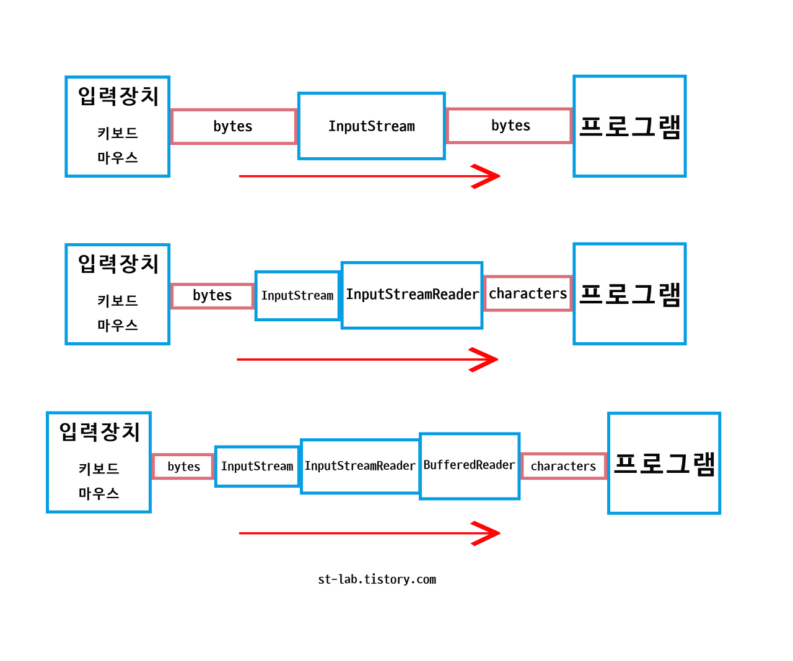
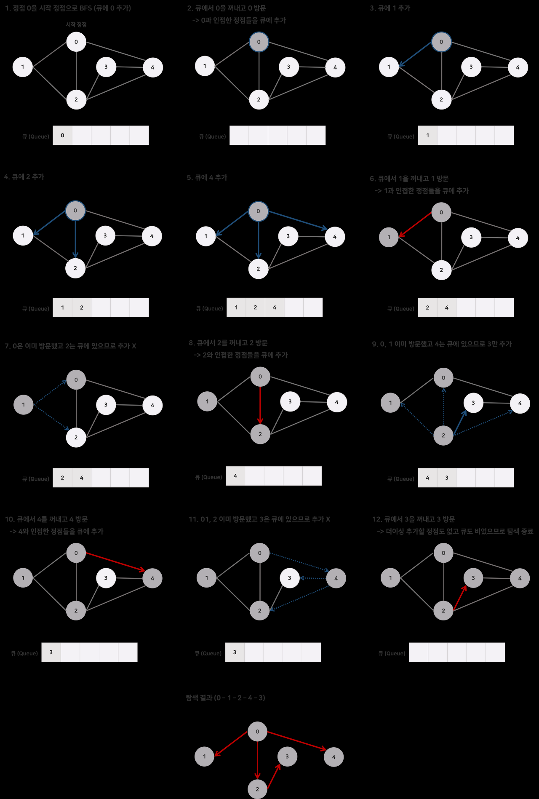
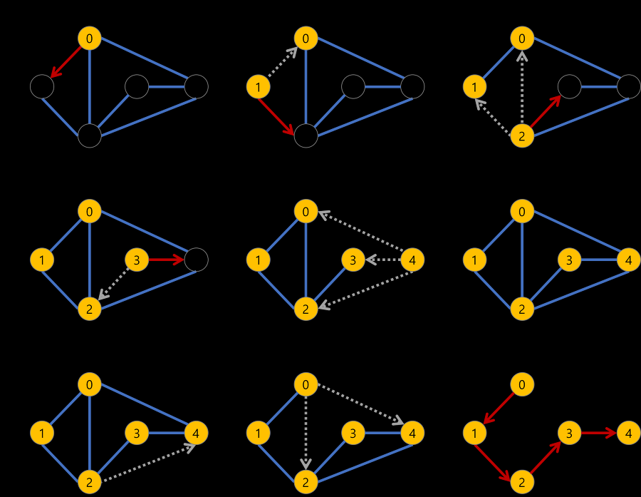

# 1000번

```java
import java.util.Scanner;
public class Main{
	public static void main(String args[]){
		Scanner sc = new Scanner(System.in);
		int a, b;
		a = sc.nextInt();
		b = sc.nextInt();
		System.out.println(a + b);
	}
}
```

# 1001번
```java
import java.util.Scanner;
public class Main{
	public static void main(String args[]){
		Scanner sc = new Scanner(System.in);
		int a, b;
		a = sc.nextInt();
		b = sc.nextInt();
		System.out.println(a - b);
	}
}
```

# 1002번
```java
import java.util.Scanner;

public class Main {

	public static void main(String[] args) {
		Scanner sc = new Scanner(System.in);
		int T = sc.nextInt();
		
		while (T-->0) {
			int x1 = sc.nextInt();
			int y1 = sc.nextInt();
			int r1 = sc.nextInt();
			
			int x2 = sc.nextInt();
			int y2 = sc.nextInt();
			int r2 = sc.nextInt();
			
			System.out.println(tangent_point(x1,y1,r1,x2,y2,r2));
		}
	}
	public static int tangent_point(int x1, int y1, int r1, int x2, int y2, int r2) {
		int distance_pow = (int)(Math.pow(x2-x1, 2)+Math.pow(y2-y1, 2));
		
		if(x1==x2&&y1==y2&&r1==r2) {
			return -1;
		}
		else if(distance_pow > Math.pow(r1+r2, 2)) {
			return  0;
		}
		else if (distance_pow < Math.pow(r2-r1, 2)) {
			return 0;
		}
		else if (distance_pow == Math.pow(r2-r1, 2)) {
			return 1;
		}
		else if (distance_pow == Math.pow(r2+r1, 2)) {
			return 1;
		}
		else {
			return 2;
		}
	}

}
```

# 1003번
```java
package exam;

import java.util.Scanner;

public class backjoon {//코드에 N이 40이고 우리는 0,1 두가지만 쓰니 2차원배열 사용
    static Integer[][] dp = new Integer[41][2];

    public static void main(String[] args) {
        Scanner sc = new Scanner(System.in);

        dp[0][0] = 1;
        dp[0][1] = 0;
        dp[1][0] = 0;
        dp[1][1] = 1;

        int T = sc.nextInt();// 첫번째 입력으로는 우리가 while을 돌릴 횟수. 초과시 while탈출

        while (T--> 0) {
            int N = sc.nextInt();// 두번째 입력은 해당 피보나치수가 나옴
            f(N);
            System.out.println(dp[N][0] + " " + dp[N][1]);
        }
    }
    static Integer[] f(int N) {
        if (dp[N][0] == null || dp[N][1] == null) {
            dp[N][0] = f(N - 1)[0] + f(N - 2)[0];
            dp[N][1] = f(N - 1)[1] + f(N - 2)[1];
        }
        return dp[N];
    }
}
```
# 1008번
```java
import java.util.Scanner;

public class backjoon1008 {
    public static void main(String[] args) {
        Scanner sc = new Scanner(System.in);
        double A = sc.nextDouble();
        double B = sc.nextDouble();

        double result = A/B;
        System.out.println(result);
    }
}
```
- 단순 나누기 문제
- 그러나 타입을 어떤걸 쓸지 5초정도는 생각하구 해야함
- buffer를 연습해보려함
```java
import java.io.BufferedReader;
import java.io.IOException;
import java.io.InputStreamReader;
import java.util.StringTokenizer;

public class backjoon1008 {
    public static void main(String[] args) throws IOException {
        BufferedReader br = new BufferedReader(new InputStreamReader(System.in));

        String str = br.readLine();
        StringTokenizer st = new StringTokenizer(str," ");
        double a = Double.parseDouble(st.nextToken());
        double b = Double.parseDouble(st.nextToken());

        System.out.println(a/b);
    }
}
```
- bufferedReader는 스캐너보다 빠른 속도로 입력이 가능한 명령어이다
- 스캐너가 왜 느리냐면 정규식을 불필요할 정도로 많이 검사하기 때문이다. 
- 강력한 정규식 검사로 인해 여러 예외적인 입력 값에 대해서도 입력받은 값이 특정 타입으로 변환 할 수 있는지를 정확하게 파악할 수 있다. 
- 즉, 타입 변환의 안정성이 매우 뛰어나다는 점이다
- 그렇게 때문에 `Scanner sc = new Scanner(System.in)`으로 스캐너를 사용하면 바이트 타입의 문자를 온전히 표현이 가능
- 하지만 우리의 `InputStream`은 바이트를 읽지만 1바이트씩 끊어서 읽음 = 온전히 못읽음
- 1바이트인게 무슨상관이냐 할 수 도 있지만
- 한글은 3바이트인 문자열이기때문에 한글 표현이 제대로 안됨
- *참고사항* 여기서 하나 기억해야할 거는 `System.in = InputStream`이다
- 그래서 `InputStreamReader`라는 걸 주고 `InputStreamReader inputstreamreader = new InputStreamReader(System.in)`를 줘서 문자를 제대로 읽도록 만듬
- 또한 `InputStreamReader`도 문자를 읽는거지 문자열을 읽는건 아니다
- 그래서 여기서 등장하는게 `BufferedReader`이다

- 총 세가지 작업을 거쳐서 작업을 하지만
- 스캐너보다 많이 빠른 것을 알 수 있다

- 이러한 연유로 버퍼드리더를 배우고 싶었고 [st-lab](st-lab.tistory.com)을 참고하였다

# 10718번
```java
public class Main {

	public static void main(String[] args) {
		System.out.println("강한친구 대한육군");
		System.out.println("강한친구 대한육군");

	}

}
```
- 그냥 기본적인 println문제

# 10998번
```java
import java.util.Scanner;

public class Main {

	public static void main(String[] args) {
		Scanner sc = new Scanner(System.in);
		int A = sc.nextInt();
		int B = sc.nextInt();
		
		System.out.println(A*B);
		
		

	}

}
```
- 기본적인 scanner + println문제
- 버퍼드를 써보려했는데 실패
- 추후 버퍼드를 써보자

# 10869번
```java
import java.util.Scanner;

public class Main {

	public static void main(String[] args) {
		Scanner sc = new Scanner(System.in);
		int A = sc.nextInt();
		int B = sc.nextInt();
		
		System.out.println(A+B);
		System.out.println(A-B);
		System.out.println(A*B);
		System.out.println(A/B);
		System.out.println(A%B);
	}

}
```
- 이거도 버퍼드 함 써보기

# 1012번
- 알고리즘 BFS
```java
package exam;


import java.io.BufferedReader;
import java.io.IOException;
import java.io.InputStreamReader;
import java.util.LinkedList;
import java.util.Queue;
import java.util.StringTokenizer;

public class backjoon1012 {
    static int M;
    static int N;
    static int K;
    static int arr[][];

    static int visited[][];

    static int list[] = new int[2601];

    public static void main(String[] args) throws IOException {
        BufferedReader br = new BufferedReader(new InputStreamReader(System.in));

        int T = Integer.valueOf(br.readLine());

        for (int tc=1; tc<=T; tc++) {
            int ANSWER = 0;

            StringTokenizer st = new StringTokenizer(br.readLine());
            M = Integer.valueOf(st.nextToken());
            N = Integer.valueOf(st.nextToken());
            K = Integer.valueOf(st.nextToken());

            arr = new int[N][M];
            visited = new int[N][M];

            for(int i = 1; i<= K; i++){
                st = new StringTokenizer(br.readLine());
                int x = Integer.valueOf(st.nextToken());
                int y = Integer.valueOf(st.nextToken());

                arr[y][x] = 1;
            }
            for(int i = 0; i < N; i++){
                for(int j = 0; j < M; j++){
                    if(visited[i][j]==0&&arr[i][j]==1){
                        ANSWER++;
                        bfs(i,j);
                    }
                }
            }
            System.out.println(ANSWER);
        }

    }

    private static void bfs(int i, int j) {
        Queue<Integer> q = new LinkedList<Integer>();

        q.offer(i*100 + j);
        visited[i][j] = 1;

        int pos = 0;
        while (q.isEmpty() == false){
            pos = q.poll();
            j= pos/100;
            j= pos%100;

            if(i > 0 && arr[i-1][j]==1 && visited[i-1][j]==0){
                visited[i-1][j]=1;
                q.offer((i-1)*100+j);
            }
            if(i < N-1 && arr[i+1][j]==1 && visited[i+1][j]==0){
                visited[i+1][j]=1;
                q.offer((i+1)*100+j);
            }
            if(j > 0 && arr[i][j-1]==1 && visited[i][j-1]==0){
                visited[i][j-1]=1;
                q.offer(i*100+(j-1));
            }
            if(j < M-1 && arr[i][j+1]==1 && visited[i][j+1]==0){
                visited[i][j+1]=1;
                q.offer(i*100+(j+1));
            }
        }


    }
}
```

- BFS를 이용한 예제이다
- BFS란 Breadth First Search의 약자
- 너비 우선 탐색

- 특징
  -  시작점으로부터 거리가 가까운 순서로 탐색
  -  그래프탐색의 경우 어떤 노드를 방문했는지 여부 검사
  -  방문한 노드를 차례로 저장 후 꺼낼 수 있는 `queue`를 사용
  -  여기서 `queue`란 선입선출하는 형태를 가진 컬렉션프레임의 일종
  -  Linkedlist 중 하나이다
  -  임포트로 Linkedlist, queue 둘다 불러와야함
  -  offer 명령어로 값을 추가하고, poll과 remove로 값을 제거한다
- 이런 특징을 이용해 0과 1의배열을 순서대로 쭉 살펴보고
- 1인 배열의 상 하 좌 우를 살펴봐서 1인값들을 찾아내 포함시켜 그룹을 만들고
- 그 그룹 수를 세면 필요한 벌레 마리 수를 알 수 있다.

# 1260번
```java
package exam;

import java.io.BufferedReader;
import java.io.IOException;
import java.io.InputStreamReader;
import java.util.LinkedList;
import java.util.Queue;
import java.util.StringTokenizer;

public class backjoon1260 {

    static StringBuilder sb = new StringBuilder();
    static boolean[] check; // 확인을 했는지 안했는지
    static int[][] arr; //간선 연결상태

    static int node, line, start;//노드는 점 개수, 라인은 간선개수, 스타트는 시작점

    static Queue<Integer> q = new LinkedList<>();

    public static void main(String[] args) throws IOException {

        BufferedReader br = new BufferedReader(new InputStreamReader(System.in));

        StringTokenizer st = new StringTokenizer(br.readLine());
        node = Integer.parseInt(st.nextToken());
        line = Integer.parseInt(st.nextToken());
        start= Integer.parseInt(st.nextToken());

        arr = new int[node+1][node+1];//좌표를 그대로 받아주려고 +1을 선언했고
        check = new boolean[node+1];// 초기값을 false로 줌

        for(int i = 0 ; i < line ; i ++) {// 간선 연결상태를 arr에 저장한다
            StringTokenizer str = new StringTokenizer(br.readLine());

            int a = Integer.parseInt(str.nextToken());
            int b = Integer.parseInt(str.nextToken());

            arr[a][b] = arr[b][a] =  1;
        }

        dfs(start); //dfs를 호출하고
        sb.append("\n");//줄바꿈을 위한 식
        check = new boolean[node+1];//확인상태를 초기화해서 다음 것을 확인할걸 대기함

        bfs(start);

        System.out.println(sb);

    }
    public static void dfs(int start) {
        //시작점을 변수로 받아 확인하고 출력 후에 다음 연결점을 찾아 시작점을 변경하면서 반복
        check[start] = true;
        sb.append(start + " ");

        for(int i = 0 ; i <= node ; i++) {
            if(arr[start][i] == 1 && !check[i])
                //둘이 같다면 i+1값으로 다음노드에 가고 아니면 dfs(i)가 실행
                dfs(i);
        }

    }

    public static void bfs(int start) {
        q.add(start);
        check[start] = true;

        while(!q.isEmpty()) {
            //q가 비어있는것을 확인, 비어있는걸 확인하고 쭉 실행
            start = q.poll();
            sb.append(start + " ");

            for(int i = 1 ; i <= node ; i++) {
                if(arr[start][i] == 1 && !check[i]) {
                    q.add(i);
                    check[i] = true;
                }
            }
        }


    }

}
```
- DFS와 BFS를 이용한 예제
- 전날 했던 BFS와 연계된 문제
- DFS를 먼저 알아보자
- DFS 는 Depth First Search
- 깊이 우선 탐색

- 주변을 탐색하는데 번호가 낮은곳으로 이동, 이것을 계속반복해서 갈곳이 없으면 갈 수 있는 곳까지 돌아가서 다시 쭉 내려간다

# 2178번
```java
import java.io.BufferedReader;
import java.io.IOException;
import java.io.InputStreamReader;
import java.util.LinkedList;
import java.util.Queue;
import java.util.StringTokenizer;

public class backjoon2178 {

    static int n;
    static int m;
    static int[][] arr;
    static boolean[][] visited;

    public static void main(String[] args) throws IOException {
        BufferedReader br = new BufferedReader(new InputStreamReader(System.in));
        StringTokenizer st = new StringTokenizer(br.readLine());

        n = Integer.parseInt(st.nextToken());// 행
        m = Integer.parseInt(st.nextToken());// 열

        arr = new int[n][m]; // 미로 지도크기를 n m 초기입력 두개로 설정
        visited = new boolean[n][m]; // 방문 여부->온적이 있다 없다 이므로 boolean
        visited[0][0] = true;

        for (int i = 0; i < n; i++) { // 지도 생성
            st = new StringTokenizer(br.readLine());
            String str = st.nextToken();
            for (int j = 0; j < m; j++) {
                arr[i][j] = str.charAt(j) - '0';
            }
        }

        bfs(0, 0);
        System.out.println(arr[n - 1][m - 1]);
    }

    public static void bfs(int x, int y) {
        Queue<int[]> q = new LinkedList<>();
        q.add(new int[] { x, y });

        // 이동 할 수 있는 가지 수, 동서남북
        int[] dx = { 1, 0, -1, 0 };
        int[] dy = { 0, 1, 0, -1 };

        while (!q.isEmpty()) { // 큐에 들어간 좌표 탐색이 모두 끝날 때까지 반복
            int[] xy = q.poll();

            for (int i = 0; i < 4; i++) { // 동, 서, 남, 북 탐색
                int nextX = xy[0] + dx[i];
                int nextY = xy[1] + dy[i];

                // 다음 지점이 미로를 벗어나거나, 벽이거나, 이미 탐색을 한 좌표이면 무시
                if (nextX < 0 || nextX >= n || nextY < 0 || nextY >= m || visited[nextX][nextY]
                        || arr[nextX][nextY] == 0) {
                    continue;
                }

                // 다음 탐색 지점을 큐에 추가
                q.add(new int[] { nextX, nextY });

                // 다음 탐색 지점 탐색처리
                visited[nextX][nextY] = true;

                // 다음 탐색 지점의 비용을 현재 좌표 + 1 로 변경
                arr[nextX][nextY] = arr[xy[0]][xy[1]] + 1;
            }
        }
    }
}
```
# 2606번
- DFS
```java
import java.io.BufferedReader;
import java.io.IOException;
import java.io.InputStreamReader;
import java.util.StringTokenizer;
//DFS, https://lotuus.tistory.com/89
public class backjoon2606_1 {
    static int count;
    static int computers;
    // 컴퓨터 개수
    static int pairs;
    // 네트워크에 연결되어 있는 컴퓨터 쌍의 수
    static boolean[] check;
    // 감염된 컴수
    static int[][] node;
    public static void main(String[] args) throws IOException {
        BufferedReader br = new BufferedReader(new InputStreamReader(System.in));
        computers = Integer.parseInt(br.readLine());
        pairs = Integer.parseInt(br.readLine());

        count = -1;
        node = new int[computers +1][computers +1];
        check = new boolean[computers +1];
        for (int i = 0; i < pairs; i++){
            StringTokenizer st = new StringTokenizer(br.readLine(),"");
            int a = Integer.parseInt(st.nextToken());
            int b = Integer.parseInt(st.nextToken());
            node[a][b] = node[b][a] = 1;
        }
        dfs(1);
        System.out.println(count);
    }
    private static void dfs(int start){
        check[start] = true;
        // 1번 컴퓨터 감염 시작
        count++;
        // +1

        for (int i = 1; i<= computers; i++){
            // 컴퓨터 개수만큼 돌릴거다
            if(node[start][i]==1 && !check[i]) {
                //start인 1번컴퓨터와 연결된 노드이면서, i번 컴퓨터가 감염되지 않았다면
                dfs(i);
                //i번 컴퓨터는 감염처리해서 dfs(i)로 저장
            }
        }
    }
}
```
- BFS
```java
import java.io.BufferedReader;
import java.io.IOException;
import java.io.InputStreamReader;
import java.util.LinkedList;
import java.util.Queue;
import java.util.StringTokenizer;

public class backjoon2606_2 {
    static int[][] node;
    static boolean[] check;
    // 감염 여부 확인
    static int count = 0;
    // 감염된 컴퓨터 수
    static Queue<Integer> q = new LinkedList<>();
    static int computers;
    static int pairs;

    public static void main(String[] args) throws IOException {
        BufferedReader br = new BufferedReader(new InputStreamReader(System.in));
        computers = Integer.parseInt(br.readLine());
        pairs = Integer.parseInt(br.readLine());

        node = new int[computers+1][computers+1];
        check = new boolean[computers+1];
        for(int i = 0; i < pairs; i++){
            StringTokenizer st = new StringTokenizer(br.readLine(),"");
            int a = Integer.parseInt(st.nextToken());
            int b = Integer.parseInt(st.nextToken());
            node[a][b] = node[b][a] = 1;
            // 1, 2 나 2, 1이 같으므로 = 방향성이 없다
        }
        bfs(1);
        // 결론적으로 1번만 호출되고, 노드를 탐색하면서
        // 다음에 어떤 노드를 탐색할 것인지 q에 저장
        // 현재 노드 탐색이 끝나면 q에 저장해둔 노드를 꺼내어 탐색
        System.out.println(count);
    }
    public static void bfs(int start){
        q.offer(start);
        check[start] = true;
        // 1번 컴퓨터 = start
        while (!q.isEmpty()){
            int temp = q.poll();
            for(int i = 0; i <= computers; i++){
                if(node[temp][i]==1 && !check[i]){
                    q.offer(i);
                    check[i] = true;
                    count++;
                }
            }
        }
    }
}
```
# 10828번
```java
import java.io.BufferedReader;
import java.io.InputStreamReader;
import java.io.IOException;
import java.util.StringTokenizer;

public class backjoon10828 {

    public static int[] stack;
    public static int size = 0;


    public static void main(String[] args) throws IOException {

        BufferedReader br = new BufferedReader(new InputStreamReader(System.in));
        StringBuilder sb = new StringBuilder();


        StringTokenizer st;

        int N = Integer.parseInt(br.readLine());

        stack = new int[N];

        while (N-- > 0) {
            st = new StringTokenizer(br.readLine(), " ");

            switch (st.nextToken()) {

                case "push":
                    push(Integer.parseInt(st.nextToken()));
                    break;

                case "pop":
                    sb.append(pop()).append('\n');
                    break;

                case "size":
                    sb.append(size()).append('\n');
                    break;

                case "empty":
                    sb.append(empty()).append('\n');
                    break;

                case "top":
                    sb.append(top()).append('\n');
                    break;
            }

        }
        System.out.println(sb);
    }

    public static void push(int item) {
        stack[size] = item;
        size++;
    }

    public static int pop() {
        if(size == 0) {
            return -1;
        }
        else {
            int res = stack[size - 1];
            stack[size - 1] = 0;
            size--;
            return res;
        }
    }

    public static int size() {
        return size;
    }

    public static int empty() {
        if(size == 0) {
            return 1;
        }
        else {
            return 0;
        }
    }

    public static int top() {
        if(size == 0) {
            return -1;
        }
        else {
            return stack[size - 1];
        }
    }

}
```
