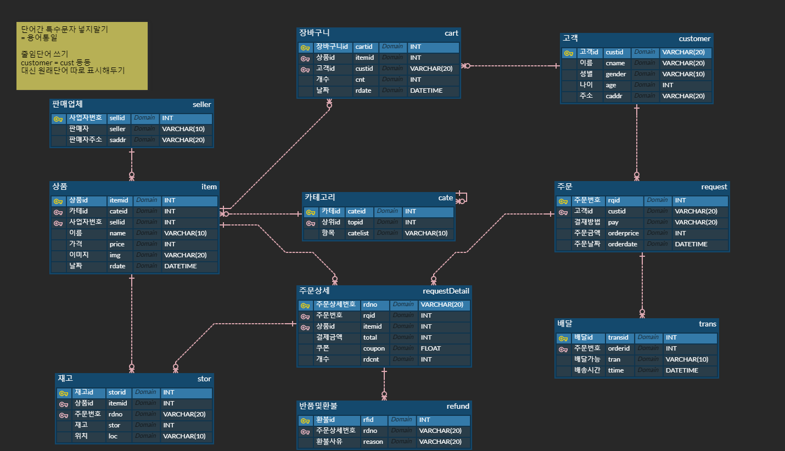

# 자바 시작하기
## 변수
> 하나의 값을 저장할 수 있는 저장 공간
### 자료형
int 정수형   
float 실수형   
double 실수형   
String 문자열

### 변수명 작성 규칙
- 첫 글자는 반드시 문자이거나 _ $로 시작
- 첫 글자에는 숫자를 사용할 수 없음
- 특수 문자는 사용할 수 없음
- 두단어 조합시 두번째 단어의 첫 글자를 대문자로
```java
public class VariableExam{
    public static void main(String[] args){
        int variable01 = 15;

        if(variable01 > 10){
            int variable02 = variable01 -10;
        }//Varialbe02는 여기까지만 의미
        int variable03 = variable02 + variable01+ 5; //variable02는 메모리에서 사라져 없으므로 에러
    }
}
```
### 강제 형변환(Casting)
> 형병환 연산자를 사용해 데이터 타입을 강제로 변환 하는 연산
### 문자열 형변환
>문자열은 어떤 자료형과 묶으면 무조건 문자열

- 기본 자료형을 문자열이면 항상 문자열이 됨
  - `1+"3" => "1 + 3"`
  - `"가"+7 => 가7`
- 문자열을 일반 자료형으로
    - 정수 : Integer.parseInt("")
    - 실수 : Double.parseDouble("")
    - 실수 : Float.parseFloat("")
## 키보드로부터 입력받기
### 데이터 입력
> Scanner 클래스 사용
> import하여 컴파일러에게 Scanner클래스 있는 곳 알려줌
### 데이터 입력 메소드
- next() : 문자열 사용자가 입력한 문자열 값
- nextLine() : 문자열 사용자 입력한 문자열의 값, 공백도 값으로 취급
- nextInt() : 정수형
```java
Scanner scan = new Scanner(System.in);//키보드로 부터 입력 받겠다는 객체 생성
```
## 제어문
### 조건문
```java
if(조건식){
    참일 때 실행할 문장}

if(조건식){
    참일 때 실행할 문장
    }else{
        거짓일 때 실행할 문장
        }

switch(변수){
    case 값1 : 실행할 문장 
    break;
    ...동 문장 반복 후 마지막에 
    default : 위의 값이 다 아닐때 실행할 문장 break;
}
```
### 반복문
```java
for(초기식; 조건식; 증감식){

}

for(int i=0; i.length<임의값; i++){

}

while (조건식){
    조건이 참일 때 반복할 문장
    }
//boolean함수 true를 조건식에 많이 넣기도함
//빠져나올때 false값을 주거나 break로 나옴
```

### 배열
> 동일한 자료형을 묶어 저장하는 참조 자료형   
> 여러 개의 값을 저장할 수 있는 공간   
> 선언시 어떤 자료형을 저장하는지 나타내야함   
> 선언시 반드시 크기를 설정
- 배열 객체 생성 및 선언
  ```java
  자료형[] 변수명 = new 자료형[크기];

  int[] arr = new int[3];
  // 크기가 3인 정수형 배열
  
  int[] arr = new int[]{10, 20, 30, 40}
  //또는
  int[] arr = {10, 20, 30, 40}
  ```

### 클래스
  > 설계도, 틀 의 역할
- 객체 지향 프로그래밍
    - 만드려고하는 완성품인 객체를 모델링하고, 집합관계에 있는 부품객체와 사용관계에 있는 객체를 하나씩 설계한 후 조립하는 방식으로 프로그램을 개발하는 기법
    - 특징
      - 캡슐화 : 정보은닉
      - 상속 : 재사용성
      - 다형성
- 클래스의 구성요소
    - 클래스 멤버 : 필드, 메소드
    - 생성자
- 객체를 생성하는 단계
    1. 클래스를 만든다(설계도, 틀)
    2. 객체 생성
    3. 객체 사용
### 접근제어자(modifier)
- public : 모든 클래스에서 사용가능
- protected : 같은 패키지에 있는 클래스에서는 모두 사용가능  
다른 패키지는 자식 클래스에서만 사용가능
- default : 접근제어자가 생략되면 모두 디폴트   
다른 패키지에서는 사용할 수 없음
- private : 같은 클래스 안에서만 자유롭게 사용할 수 있음   
  외부에서 사용하려면 getter, setter 사용해야함
### 메소드
> 객체의 동작에 해당하는 중괄호 { }블록
- 고려할 사항
  - 리턴되는 값이 없으면 void
  - 리턴값이 있으면 int String, double...)
  - 외부에서 호출하는 경우 : 참조 객체를 만들어 놓고 호출
    - 해당클래스 객체명 = new 해당클래스
    - 객체명.메소드 이런형식
  - 내부에서 호출하는 경우 : 메소드 이름으로 바로 호출
### 상속(Inher)
> 기존의 클래스를 재사용하여 새로운 클래스를 작성   
> 상위 클래스가 하위 클래스에게 물려줄 수 있는 것
- 자바는 다중상속이 불가
- 상위 메소드를 하위 메소드에서 재정의 가능
- 상위의 `private`을 갖는 필드와 메소드는 상속 못함
- final클래스는 그상태가 이미 최종
#### 클래스 상속
> 어떤 상위클래스를 따를지 `extends`로 선택
- 상위 클래스가 가지고 있는것 A,B,C
- 하위 클래스가 D,F를 가지고 있고 extends A를 하면 A,B,C,D,F 사용 가능
#### 생성자 상속
- 상위클래스가 변수1, 변수2를 설정하고
- 하위클래스에 상속을 하면 생성자를 생성하면 상위클래스의 변수도 생성자에 포함되며 상위클래스의 변수들은 `super()` 속에 들어감
#### 오버라이드
> 물려 받은 부모메소드를 자식 클래스에 맞도록 자시기에서 수정하는 것 (재정의)
- A클래스에서 a라는 (b+c)메소드를 사용한다
- B클래스에서 a라는 메소드를 (b-c)로 재정의해서 사용한다
- 실행클래스에서 A.a와 B.a를 실행하면 작동하는 메소드방식이 다르다
- 규칙
    - 부모클래스의 메소드와 동일한 시그니처를 사용
    - 반환타입까지 동일해야 함
    - 부모 클래스의 메소드보다 접근범위를 좁게 할 수 없다.
- 불가능한 경우
    - private 메소드 : 부모클래스의 멤버가 private이면 자식클래스에 상속X
    - static 메소드
    - final 메소드 : 더 이상 수정 불가
```java
public class 자식클래스 extends 부모클래스 {

}//로 구성
```
- 자바는 다중상속 X
- 상속 관계 : IS - A
- 소유 관계 : HAS - A
#### 자동타입변환
```java
class Animal{
}
```
```java
class Cat extends Animal{
}
```
- Animal(상)과 Cat(하)클래스는 상속관계다
- 객체 생성에서
```java
Cat cat = new Cat();
Animal animal = new Animal();
Animal animal = new Cat();
```
- 등등 가능
#### 다형성
> 1개의 객체를 여러가지 모양으로 표현할 수 있는 특성
1. 객체의 타입변환
  - 모든 객체를 타입변환 할 수 있는 것이 아니라 상속 관계일 때만 가능
2. 자동 타입 변환
   - 자식 클래스를 부모 클래스로 타입 변환할 수 있음
   - 자식은 부모타입으로 타입변환 가능 -> 업캐스팅
3. 강제 타입 변환
   - 부모타입 객체는 자식타입으로 변할 수 없다
   - **자식 객체지만 부모 타입 변수가 참조하고 있다면 자식 타입으로 변환 가능**
4. 타입 변환 가능 확인
   - `instance of`
   - 변수가 타입변환 할 수 있으면 true
5. 
### 추상클래스
> 추상메소드를 포함한 클래스   
> 본체가 정의 되어 있지 않은 메소드
```java
 abstract void showInfo();
 //중괄호가 없어야함
 접근제한자 abstract class 클래스명 {
 //미완성된 추상메소드
 }
```
- 상속을 통해 자식클래스에서 추상메소드를 오버로딩해서 완성
- 필요성
  - 부모의 일반메소드를 상속받은 자식은 재정의할 수도 있고 안할 수도 있다.
  - 그러나 추상메소드를 상속받은 자식은 반드시 재정의해야만 객체를 생성할 수 있다.
  - 약간 부모의 빚, 유산에 의한 상속세 지불 같은거?
  - 재정의를 놓치고 지나칠 수도 있어 크나큰 오류를 만들어 낼 수 있다. (자식이 반드시 재정의 했다는 보장을 할 수 없다)
  - 그러나 추상메소드는 자식이 재정의 하지 않으면 에러발생, 반드시 재정의 필요
- 특징
  - 추상클래스 자체로는 객체 생성불가
  - 미완성메소드를 포함하므로 heap메모리에 올릴 수 없기 때문
- 추상메소드
  - 추상클래스에서만 생성 할 수 있는 메소드
  - 중괄호가 없는 메소드구성이고
  - 공격하다가 추상메소드이면
  - 각각 상속받은 클래스들은 오버라이드해서
  - 원거리공격, 근거리공격 이렇게 재정의한다
### 인터페이스
> 추상클래스를 심화시킨 특수한 형태   
> 추상클래스와 인터페이스를 구분할 수 있어야함   
> 전부 추상이냐 아니냐의 차이
- 정의
  - 모든 필드가 `public static final`로 정의
  - 모든 메소드가 `public abstract`로 정의
- 구현(implement)를 사용
- 다중 구현이 가능
- 상속이랑 비슷한 개념이다
- **하지만 상속은 1개만 가능하고 인터페이스는 다중구현이 가능하다**
```java
interface A {...}
interface B {...}
interface C {...}
class D {...}
class E {...}
//가능한 경우
class D implements A { }
class D implements A, B { }
class D implements A, B, C { }

//불가능한 경우
class D extends D,E { }
class D extends A, B, C { }

//조건적 가능
public class Class D implements A { }
public interface A extends B { }

// 인터끼리는 구현 불가
public interface A implements B { }
```
### 예외(Exception)
> 예외와 에러의 차이   
> 예외는 연산오류, 포맷오류 등 상황에 따라 개발자가 해결 가능한 오류   
> 에러는 jvm자체의 오류로 개발자가 해결할 수 없음
- 일반예외 : 컴파일 전 빨간밑줄
- 실행예외 : run을 돌리면 나오는 예외
- 예외처리 : 예외가 뜨면 try-catch로 예외를 처리하고 계속 실행함
  ```java
  try { 예외 발생 가능 코드
  } catch (예외클래스이름 e){
    해당 예외가 발생할 경우 처리할 코드
  } finally { 예외 여부와 상관없이 무조건 실행하는 코드
  }
  ```
### 예외 떠넘기기(throws)
> 예외처리를 자신이 호출된 지점으로 떠넘긴다   
> 전가 받은 상위 위치에서 처리

- 예제를 살펴봐야 할거 같음

### 날짜/시간/표시형식
> 주로 `Date`와 `Calendar`를 사용하지만 Date는 **deprecated** 중

- Calendar클래스는 달력정보를 제공하는 클래스
- 지역, 문화에 따라 달력을 표시하는 방식이 다르기 때문에 **추상클래스**
- `Calendar now = Calendar.getInstance();`
```java
  public class CalendarTest{
    Calendar calDate = Calendar.getInstance();

    System.out.println(CalDate);//결과값이 사람말이 아님
    
    System.out.println(CalDate.get(Calendar.YEAR)+"년");//과 같은 방식으로 월, 일, 시 까지 불러올 수 있음
  }
  ```
- 규칙성 있는 숫자표시를 만들고 싶을 땐 `DecimalFomat`사용
```java
DecimalFormat df01 = new DecimalFormat("#,###");
System.out.println(df01.format(1234567));//1,234,567처럼 천단위로 끊는 규칙성을 표시해줌
DecimalFormat df02 = new DecimalFormat("#,###.00");//천단위 구분기호+소수점둘째자리(반올림처리)
```
### 제네릭(Generic)
> 클래스 내에서 사용되는 타입을 클래스가 정의할 때가 아닌 **객체를 생성할 때 정의**하겠다는 의미

- 클래스와 인터페이스 사용
- <>내부에 매개변수를 표시
- 영대문자면 어떤 것이든 사용가능
- 타입매개변수
  - 일반타입  T type
  - 원소      E element
  - 키        K key
  - 숫자      N number
  - 값        V value
### CompareTo(Object obl)
- 값을 비교하는 메소드
- 비교할 값이 매개값으로 고정값보다 크면 1, 작으면 -1, 같으면 0을 반환함
- 리턴타입은 int이다
### Thread
> 쓰레드는 cpu를 사용하는 최소단위   
> 단일 쓰레드면 2개의 작업을 처리할 때 순차적으로 처리   
> 멀티 쓰레드면 병렬처리

- 생성방법
  1. Thread클래스의 run()메소드를 오버라이딩
  2. Runnable interface 구현(추상메소드인 run()메소드를 구현)
- 실행방법
   ```java
   //클래스 만들기 - Thread클래스를 상속받아서 run()메소드를 재정의
   class MyWorkThread extends Thread{
    @Override
    public void run(){
      쓰레드 작업을 할 내용
    }
   }
   //객체 생성
   Thread myThread = new MyWorkThread();
   또는
   MyWorkThread myThread = new MyWorkThread();
   //실행
   myThread.start();
   ```
### Set 인터페이스
> 집합의 개념과 비슷하다
> 인덱스가 없고, 중복 저장이 불가능하다
1. HashSet
   - 입력 순서와 출력 순서는 동일하지 않을 수 있음   
   - 중복을 허용하지 않아서 hasCode(), equals()로 재정의
   - hasCode()->같다-->equals()-->true = 동일객체
   - 두 과정 중 하나라도 다르면 다른객체
2. TreeSet
    - 입력한 순서와 관계없이 크기순으로 출력(오름차순)
    - set의 기본 기능 + 검색/정렬 기능 추가
    - 저장 데이터는 반드시 대소비교가 가능해야함(오름차순이므로)
3. CompareTo(T t)
    - 상기 기술
### Map 계열 컬렉션 클래스
- 주로 검색용 자료구조
- 도서검색 물품검색에 탁월
- Key와 Value의 쌍으로 구성
- Key는 변경 불가, Value는 변경가능
- 인덱스가 없음

# MySQL시작하기
## RDBMS
>DB(DataBase)는 데이터의 집합
>DBMS(DBManagementSystem)은 DB를 관리, 운영하는 역할을 함
### DB의 특징
  1. 무결성
    - 데이터는 **어떤 경로**를 통해 들어 왔던지 데이터의 오류는 없어야함
  2. 독립성
    - 데이터를 변경하거나 경로를 변경해도 기존에 작성된 프로그램에 **전혀 영향을 받지 않아야함**
  3. 보안
    - 데이터를 소유한 사람이나 접근 허가가 된 사람만 접근할 수 있어야함
  4. 데이터 중복의 최소화
    - 여러개 중복되어 저장되는 것을 방지
  5. 응용 프로그램 제작 및 수정이 쉬워짐
  6. 안정성 향상 
    - 백업, 복원기능을 이용하여 데이터가 깨지는 문제를 방지
### DBMS의 종류
  1. 계층형 DBMS
  2. 망형 DBMS
  3. **관계형 DBMS** = RDBMS
    - 데이터베이스는 테이블이라 불리는 최소 단위로 구성되어 있다. 그리고 테이블은 하나 이상의 열로 구성되어 있다.
    - 따라서 테이블이라는 구조가 RDBMS에서 가장 기본적이고 중요한 구성
    - 데이터를 효율적으로 저장하기 가능
    - 여러개의 테이블을 만들어 불필요한 공간낭비 줄이기 가능
    - 여러 테이블끼리 기본 키와 외래 키의 관계로 맺어줌
    - 업무가 변화되도 쉽게 변화에 순응할 수 있음
    - 시스템 자원을 많이 차지하여 시스템이 느려질 수 있음
    - 우리가 배우려는 MySQL도 여기에 속함
## SQL
> Structured Query Language
> ANSI 에서 이를 표준화함
### SQL 특징
1. 제작회사와 독립적
2. 이식성이 좋음
3. 표준이 계속 발전
4. 대화식 언어
   - Structured Query Language가 질의적 언어. 나와 컴퓨터 사이 대화
5. 분산형 클라이언트/서버 구조
### SQL 주요 문법
1. DDL(Data Definition Language)
    - DATABASE&TABLE 생성, 삭제, 변경
2. DML(Date Manuplate Language)
    - Date CRUD(Create, Read, Update, Delete)
3. DCL(Data Control Language)
>우리는 DDL DML을 중점적으로 공부할 예정

## MySQL
> 우리가 배울 볼펜 같은 도구
> 우리는 workbench와 cmd둘다 사용할줄 알아야함
### workbench의 사용
1. 편하다
2. 실행 시 루트를 통해 설치 할때 설정한 비밀번호를 입력하여 들어감
3. 기본적인 화면에 왼쪽 schemas칸을 주로 사용하고, MySQL의 내부 디렉토리를 보여주서 직관력이 좋음
4. 다른 프로그램들과 같이 명령창이 있어서 여기서 대화를 주고 받을 수 있음
5. 번개랑 커서번개랑 두개가 있음. 번개는 명령문 전체를 실행. 커서번개는 커서가 위치한 줄만 실행.
6. 주요 명령어
```SQL
SHOW database ; --생성된 데이터 베이를 보여줘. 없을시 empty
CREATE DATABASE database ; --데이터베이스를 만들어줘
DROP DATABASE database ; --데이터베이스를 비워줘, 예제를 보니 쓰레기값을 방지하기위해 초반에 데이터베이스를 드랍시키고 다시 생성하는거 같음, 없는 데이터베이스면 1008오류가 뜸
DROP DATABASE IF EXISTS database ; -- 데이터 베이스를 비워줘 만약에 있으면
USE database ; --해당 데이터베이스를 사용할거야 = 클릭이랑 똑같음
SELECT * FROM database ; --데이터베이스 안에 테이블에 저장된 걸 보여줘
DESC database ; --구조를 출력해줘, 테이블 값의 타입을 보여줌
```
7. 명령어 부분을 대문자로 써준다
8. 백업가능
### cmd의 사용
1. 기본적인건 workbench와 똑같다
2. cmd상에서는 workbench와 같이 UI가 없으므로 텍스트에 의존해야함
3. 주요 명령어
```cmd
\mysql -u root -p ; 
MySQL을 실행하고 root유저로 비밀번호를 쳐서 들어가겠다. 그리고 설치시 설정했던 루트비밀번호를 입력
\SOURCE database.sql ;
 해당 폴더의 해당sql파일을 열어준다
*주의* 해당 폴더까지 cd를 통해 이동해주고 해당 폴더에 들어가서 실행
주요 명령어는 벤치와 똑같다
```
4. 백업 불가능. 하지만 미리 sql파일로 저장된 걸 불러올 수 있음
### SELECT
> 할게 많다
> 기본적으로 내 스타일은 `SELECT * FROM emp;`를 베이스로 *을 지워 문제에 필요한 데이터를 먼저 보고 후에 이거에 맞춰서 작업하는 스타일
> 그래서 남들보다 첫줄이 일단 길다

1. 주요 명령어
    - `WHERE` = 조건이 ~인 자료를 찾아줘
    - `NULL`은 '='을 붙이는게 아니라 IS를 붙임
    - `CONCAT(A , B)` = A+B로 합쳐진 문자로 표시
    - `SELECT name, DATE_FORMAT(mDate,'%Y') FROM usertbl;`에서 `DATE_FORMAT`은 숫자형태의 날짜를 데이트 타입으로 재정의 해주는 것. 날짜 끼리의 비교는 타입변환 없이 그대로 비교해도됨
    - `IN`은 내가 생각하는 끄집어낸 데이터들의 + 인듯
    - `WHEN ~ THEN~`구조 = ~일때 ~로 표현해줘
    - `AND`와 `OR`을 헷갈리지 않기
    - `LIMIT x, y` = x등 부터 y개의 데이터표시, 숫자 하나만 적을시 x는 0등으로 생략처리되서 탑y를 보여줌
    - `ORDER BY talbe ASC/DESC` = 정렬해줘 table을 내림차순/오름차순 으로
    - `IFNULL(table,x)`= 만약 table이라 불리는 데이터가 없으면 x라고 불러줘
    - `(CASE~END)` = 여러개의 상황 설정. 자바의 switch-case문 같은느낌
    - `DISTINCT` = 만약 카운트할때 중복되는 데이터가 있으면 중복을 없앰
    - `서브쿼리` = 쿼리안에 쿼리를 줌으로써 특정테이블로 조회하는게아닌 특정 테이블 안의 특정 자료를 나타낼 수 있음
    - 문법
      ```sql
      SELECT x, y FROM A
      GROUP BY x
      HAVING z
      ```
      - 일종의 공식으로 중복되는 문자데이터x를 그룹으로 묶어 숫자데이터y에 그룹함수 sum,avg,max,min등을 사용하여 조회하는 것
      - HAVING은 WHERE과 같은 맥락이다
      - 특정지역, 특정인물 등등의 특정데이터 뽑기
      - 
### INSERT
> DDL의 대표
> 먼저 테이블의 타입부터 확인한 후
> `INSERT INTO 테이블 VALUES();`로 데이터 넣기
- 입력하지 않은 부분은 null값이 되버림
- set 이나 delete할때나 조심해야함 데이터 날아갈 수도
- 그냥 이 파트에서 배운 명령어들
  - `CHAR`는 숫자 자리를 안맞추면 0을 추가해서 자리수를 맞춤
  - `DATE`타입에 텍스트타입으로 비슷하게 입력하면 오류없이 들어감
  - `CONCAT(A,B,C)` = A,B,C를 딱 붙여줌
  - `CHAR_LENGTH`와 `LENGTH`의 차이는 CL은 글자수 하나에 1바이트 L은 문자하나를 3파이트로 처리
  - `ADDDATE(A,B)`,`SUBDATE(A,B)` = A에 B만큼 더하거나 뺀 날짜
  - `CURDATE()`는 현재 연-월-일
  - `CURTIME()`은 현재 시:분:초
  - `DATEDIFF(A,B)` = B-A까지 몇 일이 남았다

### JOIN
> 오늘 나를 괴롭힌 존재
> 그룹과 헷갈릴 수 있지만 그룹도 같이써야할 때도 있음
> 그냥 데이터합치기 개념 or 데이터 늘리기 or 데이터 끌어다쓰기

```SQL
-- 1. 지역별 연봉의 평균
SELECT d.deptloc, AVG(e.salary) FROM emp e
-- 나타낼 테이블은 부서별 지역, 연봉의 평균
INNER JOIN dept d ON e.deptno = d.deptno
-- JOIN으로 공통분모를 묵어서
-- 하나의 테이블로 확장
GROUP BY d.deptloc;
-- 마지막에 부서별 지역으로 묶는다.
-- 대체로 문장을 이래 끊어서 보여줄것 처리한다
-- 보여줄것1.지역별/ 보여줄것2.연봉의 평균
```
> 이런식으로 중복된 값들을 뭉쳐주고 주로 평균을 구하게 시킴

```SQL
-- 2. 연봉 평균이 4000 이상인 지역을 조회
SELECT d.deptloc, AVG(e.salary) AS avg FROM emp e
-- 연봉평균 / 부서별 지역
INNER JOIN dept d ON e.deptno = d.deptno
-- 조인으로 테이블확장
GROUP BY d.deptloc
HAVING avg>= 4000;
-- 그룹으로 묶고 헤빙으로 연봉4000이상 조건을줌
```
> 돌려서 생각해보면 단순히 1번문제에서 헤빙 하나 추가한것

```SQL
-- 3. 대구 지역의 연봉 평균보다 많이 받는 지역의 월급 평균을 조회
-- 대구~지역 / 월급평균
SELECT d.deptloc, AVG(e.salary) AS avg FROM emp e
INNER JOIN dept d ON e.deptno = d.deptno
GROUP BY d.deptloc
-- 여기까지는 지역별 연봉평균
HAVING avg > (
  SELECT AVG(e.salary) FROM emp e 
  INNER JOIN dept d ON e.deptno = d.deptno
  WHERE d.deptloc = '대구');
-- 서브쿼리를 넣은 조건문
-- 나타낼 평균은 (대구지역의 평균연봉) 보다 크다
-- 간단히 표현하면 지역별 연봉평균인데 대구지역보다 큰
```
> 여기까지가 지역 연봉평균 예제 난이도 중
- `INNER JOIN`을 겹겹 쌓아서 할 수도 있다

```SQL
-- 170 이상인 회원의 구매 항목을 조회
-- 회원, 구매품목
SELECT u.name, b.prodName FROM buytbl b
INNER JOIN usertbl u ON b.userID=u.userID;
-- 여기까지는 회원들의 구매품목
WHERE u.height>170
-- 키170이라는 조건을 추가
```
- 나눠서 필요한거만 나타내기
```SQL
-- 지역별 구매금액(price*amoount)의 평균
-- 지역별 / 구매금액평균
SELECT u.addr, AVG(b.price*b.amount) FROM buytbl b
INNER JOIN usertbl u ON b.userID=u.userID
GROUP BY u.addr;
-- 지역 **별** 이므로 여기까지가 세트
```

- 다시풀어보기
  ```SQL
  --부서별 입사일 평균을 조회
  --부서별/ 입사일평균
  SELECT deptno, AVG(hdate) FROM emp
  GROUP BY deptno;
  ```
  > 알고보니 쉬운애

- 다시 풀어보기2
  ```SQL
  -- 부서별 최고연봉 직원의 평균을 구하고 그 평균보다 많이 받는 직원을 조회
  -- 그냥 평균(부서별 최고연봉직원) 과 이 직원보다 많이 받는 직원
  -- 아니다 부서별 연봉+최고연봉
  -- 1. 부서별 최고연봉부터 구한다
  SELECT MAX(salary) AS max FROM emp
  GROUP BY deptno;
  -- 2. 1.의 평균을 구한다
  SELECT AVG(max) FROM (SELECT MAX(salary) AS max FROM emp GROUP BY deptno) emp;
  -- 3. 2.보다 많이 받는 사람을 찾는다
  SELECT empname, salary FROM emp
  WHERE salary > (SELECT AVG(max) FROM (SELECT MAX(salary) AS max FROM emp GROUP BY deptno) emp);
  -- 이거만 반복해서 이해해도 말귀 다 알아 듣고 차분히 짜기 가능
  ```
  > 내 기준 난이도 상짜리 삼중쿼리

- 다시 풀어보기 3
```SQL
-- 부서 별 대리와 사원 연봉의 평균을 조회, 평균이 2500 이상인 부서만 출력
-- 부서별로 묶는데 대리와 사원/평균연봉
SELECT deptno, AVG(salary) FROM emp
WHERE titleno IN(10, 20)
GROUP BY deptno
-- 조건이 들어가는 순서도 중요
-- 대리와 사원 조건이 그룹 전에 들어가야함
HAVING AVG(salary) >= 2500;
-- 마지막 평균연봉 2500

```
- 전날풀었던 예제 중 1 (바로위)
```SQL
SELECT d.deptname, AVG(e.salary) AS avg FROM emp e
INNER JOIN dept d ON e.deptno = d.deptno
INNER JOIN title t ON e.titleno = t.titleno
WHERE t.titlename IN ('대리','사원')
GROUP BY d.deptname
HAVING avg > 2500
-- 강사님의 정답
-- IN으로 10 20을 주면 변경점이 생길때 못고칠수도 있음
-- 따라서 titleno로 조건을 주는게 아닌 titlename으로 조건을 줘서 본래 의도를 파악
-- 또한 dept으로 join을 해서 deptname을 불러온다
-- AS 하는 것도 습관화 하자
```
- 전날 풀었던 예제 2
```SQL
SELECT e.empno, e.empname, d.deptname, d.deptloc, t.titlename FROM emp e
LEFT OUTER JOIN dept d ON e.deptno = d.deptno
LEFT OUTER JOIN title t ON e.titleno = t.titleno
-- 이렇게 해야 수숩이까지 나옴
-- 그냥 이너조인을 했으면 수숩이와 다른 널값으로 되어있던게 안나옴
```

### table과 view
> 당연한 말이지만 SQL로 table을 직접짤수있다

- SQL을 다루면서 직접 만들때 시작은 무조건 `DROP`으로 해야한다
- `DROP`으로 먼저 기록되어있던 데이터들이 있는지 지우고 그 후 `CREATE`를 한다
- `DROP ~ IF EXISTS`문법으로 있는지 없는지 판별부터 한다
- 테이블을 만들때 큰 구성은 이렇다
```SQL
-- 테이블생성
CREATE TABLE A(
  -- 여러 변수와 타입설정
  -- 변수들에게 NOT NULL을 줘야할지
);
-- 제약조건
ALTER TABLE A ~ ;
  -- 제약조건을 줌으로써 변수들에게 여러 조건들을 줌

-- 데이터 삽입
INSERT INTO A ( ~ ) VALUES ( ~ );
  -- 첫번째 괄호에는 A 테이블에 넣을 변수들
  -- 두번째 괄호에는 A 테이블에 넣을 데이터들을 변수 순서대로 넣는다
  -- 첫번째 괄호가 없으면 모든변수를 다 입력해야함
```

- view는 우리가 조건에 맞게 셀렉한 것을 일종에 프리셋으로 잡아두고 언제든 꺼내쓸 수 있도록 한것

### ERD
> Entity Relationship Diagram   
> 엔티티간 상호관계 그래프   
> 즉 테이블 속 데이터들 끼리의 상호관계를 표현한 그래프이다   
> 전날 죽어라했던 title - emp - dept 의 관계  
> emp속의 titleno와 deptno가 공통분모가되어 INNER JOIN 하여 하나로 뭉치게 만들 수 있던   
> 각 엔티티 끼리 독립적이지만 공통적인걸 만들어 연결 시킴   
> ERD는 이러한 것을 그림으로 표현함

### 조별 ERD
- 1일차

- 2일차

- ERD에 대해 더 알아가야함
- 
- 위 스샷이 cate 엔티티를 SQL로 표현한 것
- ERD로는 데이터베이스를 입력하는거지 `상세데이터`를 입력하는게 아니다
- 주문이 있고 주문상세가 있는 이유는 여러품목을 주기 가능하기 때문
```SQL
DROP DATABASE IF EXISTS 365mart;
CREATE DATABASE 365mart;

USE 365mart;

DROP TABLE IF EXISTS cate;
CREATE TABLE cate(
	cateid INT,
    topid INT,
    name VARCHAR(20) NOT NULL
);
ALTER TABLE cate ADD CONSTRAINT PRIMARY KEY (cateid);
ALTER TABLE cate ADD CONSTRAINT FOREIGN KEY (topid)REFERENCES cate (cateid);
INSERT INTO cate VALUES (10, NULL, '과일/채소');
INSERT INTO cate VALUES (20, NULL, '생선/고기');
INSERT INTO cate VALUES (30, NULL, '우유/유제품');
INSERT INTO cate VALUES (40, NULL, '냉동/냉장');
INSERT INTO cate VALUES (50, NULL, '쌀잡곡');
INSERT INTO cate VALUES (60, NULL, '유아용품');
INSERT INTO cate VALUES (70, NULL, '주방용품');
INSERT INTO cate VALUES (80, NULL, '디지털용품');

INSERT INTO cate VALUES (11, 10, '과일');
INSERT INTO cate VALUES (12, 10, '채소');
INSERT INTO cate VALUES (13, 10, '구황작물');

INSERT INTO cate VALUES (21, 20, '고기');
INSERT INTO cate VALUES (22, 20, '생선');

INSERT INTO cate VALUES (31, 30, '우유');
INSERT INTO cate VALUES (32, 30, '치즈');
INSERT INTO cate VALUES (33, 30, '요거트');

INSERT INTO cate VALUES (41, 40, '볶음밥/컵밥');
INSERT INTO cate VALUES (42, 40, '튀김류');
INSERT INTO cate VALUES (43, 40, '밀키트');

INSERT INTO cate VALUES (51, 50, '쌀');
INSERT INTO cate VALUES (52, 50, '견과류');

INSERT INTO cate VALUES (61, 60, '위생용품');
INSERT INTO cate VALUES (62, 60, '완구');
INSERT INTO cate VALUES (63, 60, '유아패션');

INSERT INTO cate VALUES (71, 70, '조리도구');
INSERT INTO cate VALUES (72, 70, '식기/세제');

INSERT INTO cate VALUES (81, 80, '생활가전');
INSERT INTO cate VALUES (82, 80, '주방가전');

DROP TABLE IF EXISTS seller;
CREATE TABLE seller (
	sellid INT,
    seller VARCHAR(10) NOT NULL,
    saddr VARCHAR(20) NOT NULL
);
ALTER TABLE seller ADD CONSTRAINT PRIMARY KEY (sellid);
INSERT INTO seller VALUES (616, '고용훈', '서울 은평구');
INSERT INTO seller VALUES (725, '노주희', '대전 중구');
INSERT INTO seller VALUES (336, '신용권', '대구 북구');
INSERT INTO seller VALUES (188, '서재원', '부산 남구');
SELECT * FROM seller;

DROP TABLE IF EXISTS item;
CREATE TABLE item (
	itemid INT,
    cateid INT,
    sellid INT,
    name VARCHAR(10) NOT NULL,
    price INT NOT NULL,
    img VARCHAR(20),
    rdate DATETIME
);
ALTER TABLE item ADD CONSTRAINT PRIMARY KEY (itemid);
ALTER TABLE item MODIFY itemid INT AUTO_INCREMENT;
ALTER TABLE item AUTO_INCREMENT = 101;
ALTER TABLE item ADD CONSTRAINT FOREIGN KEY (cateid)REFERENCES cate (cateid);
ALTER TABLE item ADD CONSTRAINT FOREIGN KEY (sellid)REFERENCES seller (sellid);
ALTER TABLE item ADD CONSTRAINT CHECK (price > 0);

INSERT INTO item VALUES (NULL, 11, 616, '사과', 39800, NULL, NOW());
INSERT INTO item VALUES (NULL, 11, 616, '배', 29900, NULL, NOW());
INSERT INTO item VALUES (NULL, 11, 616, '키위', 8900, NULL, NOW());
INSERT INTO item VALUES (NULL, 11, 616, '블루베리', 27000, NULL, NOW());
INSERT INTO item VALUES (NULL, 11, 616, '포도', 43900, NULL, NOW());

INSERT INTO item VALUES (NULL, 12, 616, '두부', 1280, NULL, NOW());
INSERT INTO item VALUES (NULL, 12, 616, '양파', 15900, NULL, NOW());
INSERT INTO item VALUES (NULL, 12, 616, '깐마늘', 4900, NULL, NOW());
INSERT INTO item VALUES (NULL, 12, 616, '양배추', 5900, NULL, NOW());
INSERT INTO item VALUES (NULL, 12, 616, '당근', 13400, NULL, NOW());

INSERT INTO item VALUES (NULL, 13, 616, '밤고구마', 16500, NULL, NOW());
INSERT INTO item VALUES (NULL, 13, 616, '호박고구마', 7900, NULL, NOW());
INSERT INTO item VALUES (NULL, 13, 616, '감자', 15900, NULL, NOW());
INSERT INTO item VALUES (NULL, 13, 616, '찰옥수수', 26500, NULL, NOW());
INSERT INTO item VALUES (NULL, 13, 616, '초당옥수수', 17900, NULL, NOW());
-- 여기까지 상온 A1 0~14


INSERT INTO item VALUES (NULL, 21, 616, '삼겹살 구이용', 2200, NULL, NOW());
INSERT INTO item VALUES (NULL, 21, 616, '앞다리살 불고기용', 1500, NULL, NOW());
INSERT INTO item VALUES (NULL, 21, 616, '한우 등심', 9700, NULL, NOW());
INSERT INTO item VALUES (NULL, 21, 616, '한우 채끝살', 14500, NULL, NOW());
INSERT INTO item VALUES (NULL, 21, 616, '닭 백숙용', 8000, NULL, NOW());

INSERT INTO item VALUES (NULL, 22, 616, '고등어', 13900, NULL, NOW());
INSERT INTO item VALUES (NULL, 22, 616, '굴비', 29900, NULL, NOW());
INSERT INTO item VALUES (NULL, 22, 616, '갈치', 7000, NULL, NOW());
INSERT INTO item VALUES (NULL, 22, 616, '연어', 25900, NULL, NOW());
INSERT INTO item VALUES (NULL, 22, 616, '오징어', 5000, NULL, NOW());

INSERT INTO item VALUES (NULL, 31, 725, '흰우유', 5000, NULL, NOW());
INSERT INTO item VALUES (NULL, 31, 725, '바나나우유', 1500, NULL, NOW());
INSERT INTO item VALUES (NULL, 31, 725, '커피우유', 1800, NULL, NOW());
INSERT INTO item VALUES (NULL, 31, 725, '초코우유', 1500, NULL, NOW());
INSERT INTO item VALUES (NULL, 31, 725, '두유', 9500, NULL, NOW());

INSERT INTO item VALUES (NULL, 32, 725, '체다 치즈', 7900, NULL, NOW());
INSERT INTO item VALUES (NULL, 32, 725, '슈레드 치즈', 12000, NULL, NOW());
INSERT INTO item VALUES (NULL, 32, 725, '크림치즈', 6000, NULL, NOW());
INSERT INTO item VALUES (NULL, 32, 725, '모짜렐라 치즈', 6500, NULL, NOW());
INSERT INTO item VALUES (NULL, 32, 725, '리코타 치즈', 6000, NULL, NOW());

INSERT INTO item VALUES (NULL, 33, 725, '플레인 요거트', 6500, NULL, NOW());
INSERT INTO item VALUES (NULL, 33, 725, '요구르트', 1500, NULL, NOW());
INSERT INTO item VALUES (NULL, 33, 725, '비요뜨', 2500, NULL, NOW());
INSERT INTO item VALUES (NULL, 33, 725, '생크림', 5000, NULL, NOW());
INSERT INTO item VALUES (NULL, 33, 725, '버터', 8000, NULL, NOW());
-- 여기까지 쿨 c1 15~39


INSERT INTO item VALUES (NULL, 41, 336, '새우볶음밥', 7900, NULL, NOW());
INSERT INTO item VALUES (NULL, 41, 336, '깍두기 볶음밥', 9800, NULL, NOW());
INSERT INTO item VALUES (NULL, 41, 336, '스팸마요 컵밥', 4400, NULL, NOW());
INSERT INTO item VALUES (NULL, 41, 336, '제육덮밥 컵밥', 4500, NULL, NOW());
INSERT INTO item VALUES (NULL, 41, 336, '비빔밥 컵밥', 5000, NULL, NOW());

INSERT INTO item VALUES (NULL, 42, 336, '새우튀김', 12000, NULL, NOW());
INSERT INTO item VALUES (NULL, 42, 336, '감자튀김', 13500, NULL, NOW());
INSERT INTO item VALUES (NULL, 42, 336, '돈까스', 9500, NULL, NOW());
INSERT INTO item VALUES (NULL, 42, 336, '치킨너겟', 7500, NULL, NOW());
INSERT INTO item VALUES (NULL, 42, 336, '만두', 6500, NULL, NOW());
-- 여기까지 냉동 c2 40~49
INSERT INTO item VALUES (NULL, 51, 725, '백미', 35000, NULL, NOW());
INSERT INTO item VALUES (NULL, 51, 725, '현미', 28000, NULL, NOW());
INSERT INTO item VALUES (NULL, 51, 725, '잡곡', 30000, NULL, NOW());
INSERT INTO item VALUES (NULL, 51, 725, '찹쌀', 10000, NULL, NOW());
INSERT INTO item VALUES (NULL, 51, 725, '귀리', 9000, NULL, NOW());

INSERT INTO item VALUES (NULL, 52, 725, '호두', 7000, NULL, NOW());
INSERT INTO item VALUES (NULL, 52, 725, '아몬드', 8000, NULL, NOW());
INSERT INTO item VALUES (NULL, 52, 725, '마카다미아', 15000, NULL, NOW());
INSERT INTO item VALUES (NULL, 52, 725, '땅콩', 12000, NULL, NOW());
INSERT INTO item VALUES (NULL, 52, 725, '은행', 9000, NULL, NOW());
-- 여기는 다시 상온 50~59
INSERT INTO item VALUES (NULL, 61, 336, '화장지', 25000, NULL, NOW());
INSERT INTO item VALUES (NULL, 61, 336, '물티슈', 5000, NULL, NOW());
INSERT INTO item VALUES (NULL, 61, 336, '마스크', 10000, NULL, NOW());
INSERT INTO item VALUES (NULL, 61, 336, '칫솔', 15000, NULL, NOW());
INSERT INTO item VALUES (NULL, 61, 336, '치약', 8000, NULL, NOW());

INSERT INTO item VALUES (NULL, 62, 336, '레고', 55000, NULL, NOW());
INSERT INTO item VALUES (NULL, 62, 336, '인형', 35000, NULL, NOW());
INSERT INTO item VALUES (NULL, 62, 336, '피규어', 70000, NULL, NOW());
INSERT INTO item VALUES (NULL, 62, 336, '유아완구', 20000, NULL, NOW());
INSERT INTO item VALUES (NULL, 62, 336, '대형완구', 100000, NULL, NOW());
-- 여기까지 생활용품 60~69
INSERT INTO item VALUES (NULL, 63, 188, '티셔츠', 35000, NULL, NOW());
INSERT INTO item VALUES (NULL, 63, 188, '바지', 25000, NULL, NOW());
INSERT INTO item VALUES (NULL, 63, 188, '겉옷', 50000, NULL, NOW());
INSERT INTO item VALUES (NULL, 63, 188, '내복', 20000, NULL, NOW());
INSERT INTO item VALUES (NULL, 63, 188, '신발', 35000, NULL, NOW());
-- 여기까지 의류 70~74
INSERT INTO item VALUES (NULL, 71, 188, '프라이팬', 50000, NULL, NOW());
INSERT INTO item VALUES (NULL, 71, 188, '도마', 10000, NULL, NOW());
INSERT INTO item VALUES (NULL, 71, 188, '칼', 20000, NULL, NOW());
INSERT INTO item VALUES (NULL, 71, 188, '냄비', 35000, NULL, NOW());
INSERT INTO item VALUES (NULL, 71, 188, '주전자', 40000, NULL, NOW());

INSERT INTO item VALUES (NULL, 72, 188, '숟가락/젓가락', 15000, NULL, NOW());
INSERT INTO item VALUES (NULL, 72, 188, '주걱', 8000, NULL, NOW());
INSERT INTO item VALUES (NULL, 72, 188, '그릇', 50000, NULL, NOW());
INSERT INTO item VALUES (NULL, 72, 188, '컵', 10000, NULL, NOW());
INSERT INTO item VALUES (NULL, 72, 188, '세제', 5000, NULL, NOW());
-- 여기까지 소형 75~84
INSERT INTO item VALUES (NULL, 81, 188, '세탁기', 750000, NULL, NOW());
INSERT INTO item VALUES (NULL, 81, 188, '공기청정기', 400000, NULL, NOW());
INSERT INTO item VALUES (NULL, 81, 188, '에어컨', 800000, NULL, NOW());
INSERT INTO item VALUES (NULL, 81, 188, 'TV', 1500000, NULL, NOW());
INSERT INTO item VALUES (NULL, 81, 188, '제습기', 150000, NULL, NOW());

INSERT INTO item VALUES (NULL, 82, 188, '식기세척기', 350000, NULL, NOW());
INSERT INTO item VALUES (NULL, 82, 188, '건조기', 400000, NULL, NOW());
INSERT INTO item VALUES (NULL, 82, 188, '정수기', 250000, NULL, NOW());
INSERT INTO item VALUES (NULL, 82, 188, '전자레인지', 150000, NULL, NOW());
INSERT INTO item VALUES (NULL, 82, 188, '가스레인지', 100000, NULL, NOW());

CREATE TABLE customer (
	custid VARCHAR(20),
    cname VARCHAR(20) NOT NULL,
    -- gender BOOLEAN NOT NULL,
    gender VARCHAR(10),
    age int NOT NULL,
    caddr VARCHAR(20) NOT NULL
);
ALTER TABLE customer ADD CONSTRAINT PRIMARY KEY (custid);
INSERT INTO customer VALUES('abc','강동우','남',38,'서울 강남구');
INSERT INTO customer VALUES('def','강민정','여',27,'서울 은평구');
INSERT INTO customer VALUES('ghi','김재준','남',32,'서울 강동구');
INSERT INTO customer VALUES('jkl','박유리','여',36,'서울 구로구');
INSERT INTO customer VALUES('mno','정석민','남',38,'서울 마포구');
INSERT INTO customer VALUES('pqr','장성혜','여',24,'경기도 용인시');
INSERT INTO customer VALUES('stu','고대준','남',45,'경기도 이천시');
INSERT INTO customer VALUES('vwx','현은재','여',57,'강원도 강릉시');
INSERT INTO customer VALUES('yza','신상범','남',51,'경북 대구시');
INSERT INTO customer VALUES('bcd','이은숙','여',70,'전남 나주시');
INSERT INTO customer VALUES('efg','정희천','남',66,'전북 전주시');
INSERT INTO customer VALUES('hij','김민지','여',32,'경남 부산시');

CREATE TABLE cart (
	cartid INT,
    itemid INT NOT NULL,
    custid VARCHAR(20),
    cnt INT NOT NULL,
    rdate DATETIME
);
ALTER TABLE cart ADD CONSTRAINT PRIMARY KEY (cartid);
ALTER TABLE cart ADD CONSTRAINT FOREIGN KEY (itemid)REFERENCES item (itemid);
ALTER TABLE cart ADD CONSTRAINT FOREIGN KEY (custid)REFERENCES customer (custid);
ALTER TABLE cart ADD CONSTRAINT CHECK (cnt >= 0);
INSERT INTO cart VALUES(1234,101,'abc',10,'2022-09-01 21:09:21');
INSERT INTO cart VALUES(1235,103,'def',10,'2022-09-02 12:00:00');
INSERT INTO cart VALUES(1236,151,'jkl',31,'2022-09-03 19:24:01');
INSERT INTO cart VALUES(1237,161,'mno',300,'2022-09-05 17:22:21');

INSERT INTO cart VALUES(1238,184,'efg',35,'2022-09-27 15:35:28');
INSERT INTO cart VALUES(1239,194,'ghi',3000,'2022-08-01 22:09:21');
INSERT INTO cart VALUES(1240,153,'pqr',10,'2022-08-24 13:00:00');
INSERT INTO cart VALUES(1241,152,'vwx',31,'2022-08-25 19:24:04');

INSERT INTO cart VALUES(1242,151,'hij',300,'2022-09-05 16:22:21');
INSERT INTO cart VALUES(1243,121,'stu',35,'2022-09-08 20:35:28');
INSERT INTO cart VALUES(1244,134,'yza',300,'2022-09-05 17:22:21');
INSERT INTO cart VALUES(1245,111,'bcd',35,'2022-09-08 14:35:28');

CREATE TABLE request(
	rqid INT,
	custid VARCHAR(20) NOT NULL,
	pay VARCHAR(20) NOT NULL,
    orderprice INT,
    orderdate DATETIME
);
ALTER TABLE request ADD CONSTRAINT PRIMARY KEY (rqid);
ALTER TABLE request MODIFY rqid INT AUTO_INCREMENT;
ALTER TABLE request AUTO_INCREMENT=1;
ALTER TABLE request ADD CONSTRAINT FOREIGN KEY (custid)REFERENCES customer (custid);

INSERT INTO request VALUES(NULL,'abc','신용카드',NULL,NULL);
INSERT INTO request VALUES(NULL,'def','무통장입금',NULL,NULL);
INSERT INTO request VALUES(NULL,'ghi','계좌이체',NULL,NULL);
INSERT INTO request VALUES(NULL,'jkl','무통장입금',NULL,NULL);
INSERT INTO request VALUES(NULL,'mno','신용카드',NULL,NULL);
INSERT INTO request VALUES(NULL,'pqr','계좌이체',NULL,NULL);
INSERT INTO request VALUES(NULL,'stu','계좌이체',NULL,NULL);
INSERT INTO request VALUES(NULL,'vwx','무통장입금',NULL,NULL);
INSERT INTO request VALUES(NULL,'yza','신용카드',NULL,NULL);
INSERT INTO request VALUES(NULL,'bcd','신용카드',NULL,NULL);
INSERT INTO request VALUES(NULL,'efg','무통장입금',NULL,NULL);
INSERT INTO request VALUES(NULL,'hij','계좌이체',NULL,NULL);

DROP TABLE IF EXISTS requestDetail;
CREATE TABLE requestDetail(
	rdno VARCHAR(20),
    rqid INT,
    itemid INT,
    total INT,
    coupon FLOAT,
    rdcnt INT
);
ALTER TABLE requestDetail ADD CONSTRAINT PRIMARY KEY (rdno);
ALTER TABLE requestDetail ADD CONSTRAINT CHECK (coupon >= 0);
ALTER TABLE requestDetail ADD CONSTRAINT FOREIGN KEY (rqid)REFERENCES request (rqid);
ALTER TABLE requestDetail ADD CONSTRAINT FOREIGN KEY (itemid)REFERENCES item (itemid);

INSERT INTO requestdetail VALUES ('a',1,101,NULL,0,5);
INSERT INTO requestdetail VALUES ('b',2,150,NULL,0,10);
INSERT INTO requestdetail VALUES ('c',3,140,NULL,0,9);
INSERT INTO requestdetail VALUES ('d',4,120,NULL,0,4);
INSERT INTO requestdetail VALUES ('e',5,115,NULL,0,2);

CREATE TABLE trans(
	transid INT,
    orderid INT,
    tran VARCHAR(10) NOT NULL,
    ttime DATETIME
);
ALTER TABLE trans ADD CONSTRAINT PRIMARY KEY (transid);
ALTER TABLE trans MODIFY transid INT AUTO_INCREMENT;
ALTER TABLE trans AUTO_INCREMENT = 1;
ALTER TABLE trans ADD CONSTRAINT FOREIGN KEY (orderid)REFERENCES request (rqid);

INSERT INTO trans VALUES (NULL, 1, '가능', NOW());
INSERT INTO trans VALUES (NULL, 2, '불가능', NULL);
INSERT INTO trans VALUES (NULL, 3, '가능', NOW());
INSERT INTO trans VALUES (NULL, 4, '가능', NOW());
INSERT INTO trans VALUES (NULL, 5, '가능', NOW());
INSERT INTO trans VALUES (NULL, 6, '가능', NOW());
INSERT INTO trans VALUES (NULL, 7, '불가능', NULL);
INSERT INTO trans VALUES (NULL, 8, '가능', NOW());
INSERT INTO trans VALUES (NULL, 9, '가능', NOW());
INSERT INTO trans VALUES (NULL, 10, '가능', NOW());
INSERT INTO trans VALUES (NULL, 11, '가능', NOW());
INSERT INTO trans VALUES (NULL, 12, '가능', NOW());

CREATE TABLE stor(
	storid INT,
    itemid INT,
    stor INT ,
    loc VARCHAR(10)
);
ALTER TABLE stor ADD CONSTRAINT PRIMARY KEY (storid);
ALTER TABLE stor MODIFY storid INT AUTO_INCREMENT;
ALTER TABLE stor AUTO_INCREMENT = 0;

ALTER TABLE stor ADD CONSTRAINT FOREIGN KEY (itemid)REFERENCES item (itemid);
ALTER TABLE stor ADD CONSTRAINT CHECK (stor >= 0);

INSERT INTO stor VALUES(NULL, 101, 1000, 'A1');
INSERT INTO stor VALUES(NULL, 102, 1500, 'A1');
INSERT INTO stor VALUES(NULL, 103, 1600, 'A1');
INSERT INTO stor VALUES(NULL, 104, 1200, 'A1');
INSERT INTO stor VALUES(NULL, 105, 2000, 'A1');
INSERT INTO stor VALUES(NULL, 106, 1900, 'A1');
INSERT INTO stor VALUES(NULL, 107, 2100, 'A1');
INSERT INTO stor VALUES(NULL, 108, 1300, 'A1');
INSERT INTO stor VALUES(NULL, 109, 1000, 'A1');
INSERT INTO stor VALUES(NULL, 110, 2000, 'A1');
INSERT INTO stor VALUES(NULL, 111, 1700, 'A1');
INSERT INTO stor VALUES(NULL, 112, 1000, 'A1');
INSERT INTO stor VALUES(NULL, 113, 1000, 'A1');
INSERT INTO stor VALUES(NULL, 114, 1000, 'A1');
INSERT INTO stor VALUES(NULL, 115, 1000, 'A1');
-- 상온보관 A1
INSERT INTO stor VALUES(NULL, 116, 300, 'C1');
INSERT INTO stor VALUES(NULL, 117, 200, 'C1');
INSERT INTO stor VALUES(NULL, 118, 270, 'C1');
INSERT INTO stor VALUES(NULL, 119, 250, 'C1');
INSERT INTO stor VALUES(NULL, 120, 200, 'C1');
INSERT INTO stor VALUES(NULL, 121, 1000, 'C1');
INSERT INTO stor VALUES(NULL, 122, 900, 'C1');
INSERT INTO stor VALUES(NULL, 123, 800, 'C1');
INSERT INTO stor VALUES(NULL, 124, 1000, 'C1');
INSERT INTO stor VALUES(NULL, 125, 1100, 'C1');
INSERT INTO stor VALUES(NULL, 126, 1000, 'C1');
INSERT INTO stor VALUES(NULL, 127, 700, 'C1');
INSERT INTO stor VALUES(NULL, 128, 800, 'C1');
INSERT INTO stor VALUES(NULL, 129, 600, 'C1');
INSERT INTO stor VALUES(NULL, 130, 500, 'C1');
INSERT INTO stor VALUES(NULL, 131, 900, 'C1');
INSERT INTO stor VALUES(NULL, 132, 1000, 'C1');
INSERT INTO stor VALUES(NULL, 133, 500, 'C1');
INSERT INTO stor VALUES(NULL, 134, 500, 'C1');
INSERT INTO stor VALUES(NULL, 135, 700, 'C1');
INSERT INTO stor VALUES(NULL, 136, 1000, 'C1');
INSERT INTO stor VALUES(NULL, 137, 700, 'C1');
INSERT INTO stor VALUES(NULL, 138, 500, 'C1');
INSERT INTO stor VALUES(NULL, 139, 500, 'C1');
INSERT INTO stor VALUES(NULL, 140, 1000, 'C1');
-- 40번까지 + 15~40까지 냉장보관
INSERT INTO stor VALUES(NULL, 141, 700, 'C2');
INSERT INTO stor VALUES(NULL, 142, 800, 'C2');
INSERT INTO stor VALUES(NULL, 143, 700, 'C2');
INSERT INTO stor VALUES(NULL, 144, 900, 'C2');
INSERT INTO stor VALUES(NULL, 145, 900, 'C2');
INSERT INTO stor VALUES(NULL, 146, 800, 'C2');
INSERT INTO stor VALUES(NULL, 147, 900, 'C2');
INSERT INTO stor VALUES(NULL, 148, 700, 'C2');
INSERT INTO stor VALUES(NULL, 149, 800, 'C2');
INSERT INTO stor VALUES(NULL, 150, 700, 'C2');
-- 50번까지 40~50 냉동보관
INSERT INTO stor VALUES(NULL, 151, 1000, 'A1');
INSERT INTO stor VALUES(NULL, 152, 1000, 'A1');
INSERT INTO stor VALUES(NULL, 153, 1000, 'A1');
INSERT INTO stor VALUES(NULL, 154, 1000, 'A1');
INSERT INTO stor VALUES(NULL, 155, 1000, 'A1');
INSERT INTO stor VALUES(NULL, 156, 1000, 'A1');
INSERT INTO stor VALUES(NULL, 157, 1000, 'A1');
INSERT INTO stor VALUES(NULL, 158, 1000, 'A1');
INSERT INTO stor VALUES(NULL, 159, 1000, 'A1');
INSERT INTO stor VALUES(NULL, 160, 1000, 'A1');
-- 50~60 상온보관
INSERT INTO stor VALUES(NULL, 161, 1500, 'L1');
INSERT INTO stor VALUES(NULL, 162, 1300, 'L1');
INSERT INTO stor VALUES(NULL, 163, 1200, 'L1');
INSERT INTO stor VALUES(NULL, 164, 1300, 'L1');
INSERT INTO stor VALUES(NULL, 165, 1100, 'L1');
-- 65번까지
INSERT INTO stor VALUES(NULL, 166, 1300, 'L1');
INSERT INTO stor VALUES(NULL, 167, 1400, 'L1');
INSERT INTO stor VALUES(NULL, 168, 1200, 'L1');
INSERT INTO stor VALUES(NULL, 169, 1500, 'L1');
INSERT INTO stor VALUES(NULL, 170, 1000, 'L1');
-- 65~70 소형물품보관장소
INSERT INTO stor VALUES(NULL, 171, 1000, 'W1');
INSERT INTO stor VALUES(NULL, 172, 800, 'W1');
INSERT INTO stor VALUES(NULL, 173, 800, 'W1');
INSERT INTO stor VALUES(NULL, 174, 900, 'W1');
INSERT INTO stor VALUES(NULL, 175, 800, 'W1');
-- 70~75 의류
INSERT INTO stor VALUES(NULL, 176, 200, 'L1');
INSERT INTO stor VALUES(NULL, 177, 200, 'L1');
INSERT INTO stor VALUES(NULL, 178, 300, 'L1');
INSERT INTO stor VALUES(NULL, 179, 150, 'L1');
INSERT INTO stor VALUES(NULL, 180, 170, 'L1');
INSERT INTO stor VALUES(NULL, 181, 130, 'L1');
INSERT INTO stor VALUES(NULL, 182, 110, 'L1');
INSERT INTO stor VALUES(NULL, 183, 150, 'L1');
INSERT INTO stor VALUES(NULL, 184, 160, 'L1');
INSERT INTO stor VALUES(NULL, 185, 140, 'L1');
-- 85번까지 소형가전보관소
INSERT INTO stor VALUES(NULL, 186, 20, 'L2');
INSERT INTO stor VALUES(NULL, 187, 20, 'L2');
INSERT INTO stor VALUES(NULL, 188, 30, 'L2');
INSERT INTO stor VALUES(NULL, 189, 15, 'L2');
INSERT INTO stor VALUES(NULL, 190, 17, 'L2');
INSERT INTO stor VALUES(NULL, 191, 13, 'L2');
INSERT INTO stor VALUES(NULL, 192, 11, 'L2');
INSERT INTO stor VALUES(NULL, 193, 15, 'L2');
INSERT INTO stor VALUES(NULL, 194, 16, 'L2');
INSERT INTO stor VALUES(NULL, 195, 14, 'L2');
-- 95번까지 대형물품 창고

CREATE TABLE refund(
	rfid INT,
    rdno VARCHAR(20) NOT NULL,
    reason VARCHAR(20) NOT NULL
);
ALTER TABLE refund ADD CONSTRAINT PRIMARY KEY (rfid);
ALTER TABLE refund ADD CONSTRAINT FOREIGN KEY (rdno)REFERENCES requestDetail (rdno);

INSERT INTO refund VALUES ( 1, 'a', '단순변심');
INSERT INTO refund VALUES ( 2, 'b', '상품파손');
INSERT INTO refund VALUES ( 3, 'c', '서비스불만족');
INSERT INTO refund VALUES ( 4, 'd', '주문실수');

SELECT * FROM cart;
SELECT * FROM cate;
SELECT * FROM customer;
SELECT * FROM item;
SELECT * FROM refund;
SELECT * FROM request;
SELECT * FROM requestdetail;
SELECT * FROM seller;
SELECT * FROM stor;
SELECT * FROM trans;
```
- SQL문과 DDL과 ERD를 섞어보았지만
- 아직 연동에 미숙했던 관계로 모자란부분이 많이 보인다

- 보완해야할 부분
	1. 이미지 -->제일 마지막에 해볼것
	2. request에 orderPrice와 orderDate 적기
	3. requestDetail 수 늘리기
	4. stor에 itemid값과 rdno값 넣기

```SQL
-- 특정조건 고객이 구매한 상품내역 조회
-- 특정조건의 품목을 구매한 고객 조회
-- 특정 업체에서 판매하는 상품을 구매한 고객 조회
-- 특정 상품을 구매한 고객의 총 구매 금액
-- 특정 상품의 보관장소 등등

-- 1. 남자고객 중 과일/채소를 장바구니에 넣은사람(고객이름, 고객성별, 카테고리번호, 상품이름)
SELECT cu.cname, cu.gender, it.cateid, it.name FROM customer cu
INNER JOIN cart ca ON cu.custid = ca.custid
INNER JOIN item it ON ca.itemid = it.itemid
WHERE cu.gender Like '남'
AND it.cateid IN(10, 11, 12);

-- 2. 서울 거주중인 사람중 구매액이 가장 큰사람
SELECT * FROM customer
WHERE caddr='서울%'; -- 이건 쓰레기문제

-- 3. 판매자'노주희'가 파는 물건 중 가장 비싼 물건
SELECT * FROM seller se
INNER JOIN item it ON se.sellid = it.sellid
WHERE seller = '노주희'
ORDER BY price DESC
LIMIT 0,1;

-- 4. 정희천이 장바구니 총금액
SELECT cu.cname, (ca.cnt*it.price) AS total FROM customer cu
INNER JOIN cart ca ON cu.custid=ca.custid
INNER JOIN item it ON ca.itemid=it.itemid
WHERE cu.cname = '정희천';

-- 5. 신용카드로 결재한 사람 중 성이 강씨 인 사람
SELECT * FROM customer cu
INNER JOIN request re ON cu.custid=re.custid
WHERE re.pay = '신용카드'
AND cu.cname = '강%';
```
- 우리가 만든 sql에 대한 select 문제 4개
- 최대한 배운 것을 써보려했구 단비님 문제도 추가해서 풀어볼 예정
- 내가 문제를 더 만들어서 이것 저것해보며 SQL이 무뎌지지않도록 할 예정

### JAVA와 MySQL 연동
- 자바와 SQL을 연동 시켜서 자바로 SQL을 작성하게 할 수 있다
- SQL에서 루트 말고 다른 계정을 생성
```java
package dto;

public class CustDTO {
	private String id;
	private String pwd;
	private String name;

	public CustDTO() {
	}

	public CustDTO(String id, String pwd, String name) {
		this.id = id;
		this.pwd = pwd;
		this.name = name;
	}

	public String getId() {
		return id;
	}

	public void setId(String id) {
		this.id = id;
	}

	public String getPwd() {
		return pwd;
	}

	public void setPwd(String pwd) {
		this.pwd = pwd;
	}

	public String getName() {
		return name;
	}

	public void setName(String name) {
		this.name = name;
	}

	@Override
	public String toString() {
		return "CustDTO [id=" + id + ", pwd=" + pwd + ", name=" + name + "]";
	}

}
```
- 고객DTO로 설계클래스에 해당됨
- 고객정보이니 private설정
- 혹시모를 오버로딩때문에 기본생성자+필드생성자 만들어줌
- toString까지 오버라이드 해준다
```java
package dao;

import java.sql.Connection;
import java.sql.DriverManager;
import java.sql.PreparedStatement;
import java.sql.ResultSet;
import java.sql.SQLException;
import java.util.ArrayList;

import dto.CustDTO;
import sql.Sql;

public class CustDAO {
	String url = "jdbc:mysql://172.30.1.1:3306/shopdb?serverTimezone=Asia/Seoul";
	String mid = "suser01";
	String mpwd = "111111";

	public CustDAO() {
		try {
			Class.forName("com.mysql.cj.jdbc.Driver");
			System.out.println("MySQL JDBC Driver Loading ... ");
		} catch (ClassNotFoundException e) {
			e.printStackTrace();
		}
	}

	public Connection getConnection() {
		Connection con = null;
		try {
			con = DriverManager.getConnection(url, mid, mpwd);
			System.out.println("MySQL Server Connected ... ");
		} catch (SQLException e) {
			e.printStackTrace();
		}
		return con;
	}

	public void close(PreparedStatement pstmt) {
		if (pstmt != null) {
			try {
				pstmt.close();
			} catch (SQLException e) {
				e.printStackTrace();
			}
		}
	}

	public void close(ResultSet rset) {
		if (rset != null) {
			try {
				rset.close();
			} catch (SQLException e) {
				e.printStackTrace();
			}
		}
	}

	public void close(Connection conn) {
		if (conn != null) {
			try {
				conn.close();
			} catch (SQLException e) {
				e.printStackTrace();
			}
		}
	}

	// 1.여기서부터 crud메소드를 구현
	public void insert(CustDTO cust) throws SQLException { // 13. insert메소드에 sql익셉션을 박음, insert를 땡겨쓰는 위치에서 오류처리하도록
		// 2. 데이터베이스 연결
		Connection con = null; // 3. 내부에서 끌어다 쓰는거니 객체생성 없이 바로 사용가능+ 쓰레기값 방지의 null
		con = getConnection(); // 4. getConnection메소드로 받아온걸 con에 담기
		// 5. SQL 문장을 준비
		// 6. MySQL로 보낼 변수 정의, sql문으로 보내버림
		PreparedStatement pstmt = null; // 7. null값의 pstmt객체 생성
		try {
			pstmt = con.prepareStatement(Sql.insertCust); // 8. con의 prepareStatement를 불러와서 6에서 정의한 것을 적용시키고 pstmt에 담기,
															// 근데 에러가뜨기에 작성후 try/catch로 해줌
			// SQL 문장에 데이터를 입력
			pstmt.setString(1, cust.getId()); // 9. setString을 이용하여 pstmt에 인덱스(6번에서 정의한 insertCust의 첫번째 물음표)에 담기
			pstmt.setString(2, cust.getPwd());
			pstmt.setString(3, cust.getName());
			// 10. SQL 문을 데이터베이스에 전송
			pstmt.executeUpdate(); // 11. executeUpdate를 사용하여 pstmt에 담아져있는 것을 연동된 SQL로 보내버린다
		} catch (SQLException e) {
			throw e; // 12. 하지만 여기서 익셉션이 떠서 옆에 CustApp클래스에서는 오류난걸 모름, 그래서 여기서 처리 안하고 던져버리려고 throw를 사용
		}
		// 데이터베이스 연결해제
		close(pstmt);
		close(con); // 14. 마지막으로 다 사용했으면 close해달라
	}

	public void delete(String id) throws SQLException {
		// 커넥션필요
		Connection con = null;
		con = getConnection();
		// SQL문 필요
		PreparedStatement pstmt = null;
		try {
			pstmt = con.prepareStatement(Sql.deleteCust);
			pstmt.setString(1, id);
			pstmt.executeUpdate();
		} catch (SQLException e) {
			throw e;// insert랑 구조는 똑같음
		}
		close(pstmt);
		close(con);

	}

	public void update(CustDTO cust) throws SQLException {
		Connection con = null;
		con = getConnection();

		PreparedStatement pstmt = null;
		try {
			pstmt = con.prepareStatement(Sql.updateCust);
			pstmt.setString(1, cust.getPwd());
			pstmt.setString(2, cust.getName());
			pstmt.setString(3, cust.getId());
			pstmt.executeUpdate();
		} catch (SQLException e) {
			throw e;
		}
		close(pstmt);
		close(con);

	}

	public CustDTO select(String id) throws SQLException {
		CustDTO cust = null; // 1. cust객체를 생성해서 잘 리턴하는게 목표

		Connection con = null;
		con = getConnection();
		PreparedStatement pstmt = null;
		ResultSet rset = null; // 3. rset은 결과를 받는 sql내장메소드
		try {
			pstmt = con.prepareStatement(Sql.selectCust);
			pstmt.setString(1, id);// 2. select는 결과가 일로 다시 와야함
			rset = pstmt.executeQuery();
			rset.next();// 4. 이거를 한칸 이동해줘야 전줄에 있던 커서가 한칸 내려와서 내가 원하는 줄에 커서가 옴
			String rid = rset.getString("id");// 5. 컬럼의 이름 = 데이터
			String rpwd = rset.getString("pwd");
			String rname = rset.getString("name");
			cust = new CustDTO(rid, rpwd, rname); // 6. 불러온 애들을 cust에 객체로 저장
		} catch (SQLException e) {
			throw e;
		}
		close(rset);
		close(pstmt);
		close(con);
		return cust;
	}

	public ArrayList<CustDTO> select() throws SQLException {
		ArrayList<CustDTO> list = new ArrayList<CustDTO>();
		Connection con = null;
		PreparedStatement pstmt = null;
		ResultSet rset = null;
		try {
			con = getConnection();
			pstmt = con.prepareStatement(Sql.selectallCust);
			rset = pstmt.executeQuery();// 지금은 여러건의 정보가 들어가 있는 상태. 여러개가 있으면 반복돌려야함
			while (rset.next()) { // 오래되서 for를 못돌림, rset의 처음부터 끝까지 한줄씩 돌린다 라고 하는것
				String id = rset.getNString("id");
				String pwd = rset.getNString("pwd");
				String name = rset.getNString("name");
				CustDTO cust = new CustDTO(id, pwd, name);
				list.add(cust);// add가 list에 다 채워져야 끝남
			}
		} catch (SQLException e) {
			throw e;
		}
		close(rset);
		close(pstmt);
		close(con);
		return list;
	}

}
```
- 생성순서는 일단 번호로 적어놓음
- 여기는 기능들을 모아놓은 기능클래스

```java
package sql;

public class Sql {//sql문만 관리하는 클래스
	public static String insertCust = "INSERT INTO cust VALUES (?, ?, ?)";
	public static String deleteCust = "DELETE FROM cust WHERE id = ?";
	public static String updateCust = "UPDATE cust SET pwd = ?, name = ? WHERE id = ?";
	public static String selectCust = "SELECT * FROM cust WHERE id = ?";
	public static String selectallCust = "SELECT * FROM cust";
	
	public static String insertItem = "INSERT INTO item VALUES (NULL, ?, ?, NOW())";
	public static String deleteItem = "DELETE FROM item WHERE id = ?";
	public static String updateItem = "UPDATE item SET name = ? price=? WHERE id = ?";
	public static String selectItem = "SELECT * FROM item WHERE id = ?";
	public static String selectallItem = "SELECT * FROM item";
}
```
- 문자열을 따로 처리하고 싶어서 만든 문자열클래스
- item부분까지 추가함
  
```java
package ui;

import java.sql.SQLException;
import java.util.ArrayList;
import java.util.Scanner;

import dao.CustDAO;
import dto.CustDTO;

public class CustApp {

	public static void main(String[] args) {

		CustDAO dao = new CustDAO();

		System.out.println("Start");
		Scanner sc = new Scanner(System.in);
		while (true) {
			System.out.println("Input CMD(q,c,r,ar,u,d)..?");
			String cmd = sc.next();
			if (cmd.equals("q")) {
				System.out.println("Bye ...");
				sc.close();
				break;
			} else if (cmd.equals("c")) {
				System.out.println("INSERT ...");
				System.out.println("INPUT ID,PWD, NAME ...");
				String id = sc.next();
				String pwd = sc.next();
				String name = sc.next();
				CustDTO cust = new CustDTO(id, pwd, name);
				try {
					dao.insert(cust); // 14. 옆집에서 오류처리 안하겠다 소문나서 얘도 오류 대비하라 뜸, 따라서 try/catch로 오류를 받고 "입력오류"를 표현해줌
					System.out.println("INSERTED " + id + " " + pwd + " " + name);
				} catch (SQLException e) {
					System.out.println("입력 오류");
				}

			} else if (cmd.equals("r")) {
				System.out.println("SELECT ONE ...");
				System.out.println("INPUT ID ...");
				String id = sc.next();
				CustDTO cust = null;
				try {
					cust = dao.select(id); // dao에 id를 넣어주면 CustDTO의 select메소드가 돌아가면서 cust가 리턴되고 이곳의 cust에 담는다
					System.out.println(cust);// 그걸 보여줌
				} catch (SQLException e) {
					System.out.println("조회 오류");
				}

			} else if (cmd.equals("ar")) {
				System.out.println("SELECT ALL ...");
				ArrayList<CustDTO> list = null; // dao.select이 줄거니까 널값
				try {
					list = dao.select();
					for (CustDTO c : list) {// for (타입 : 컬렉션)
						System.out.println(c);
					}
				} catch (SQLException e) {
					System.out.println("전체 조회 오류");
				}

			} else if (cmd.equals("u")) {
				System.out.println("UPDATE ...");
				System.out.println("INPUT ID,PWD, NAME ...");
				String id = sc.next();
				String pwd = sc.next();
				String name = sc.next();
				CustDTO cust = new CustDTO(id, pwd, name);
				try {
					dao.update(cust);
					System.out.println("UPDATED " + id + " " + pwd + " " + name);
				} catch (SQLException e) {
//					e.printStackTrace();
					System.out.println("수정 오류");
				}

			} else if (cmd.equals("d")) {
				System.out.println("DELETE ...");
				System.out.println("INPUT ID ...");
				String id = sc.next();
				try {
					dao.delete(id);
					System.out.println("DELETED " + id);
				} catch (SQLException e) {
					System.out.println("삭제 오류");
				}
			}

		} // while문 종료지점

		System.out.println("Exit ..");

	}

}
```
- 이 패키지의 메인클래스이다
- 은근 심플하게 잘 되어있다
- OOAD UML에 대해 설명 해주셨는데 따로 찾아봐야 할 듯
- 연동은 잘 된듯한데 item이 뭔가 구현이 잘 안돼서 이거까지 처리하고 사진까지 첨부할 예정

```java
package dto;

import java.util.Date;

public class ItemDTO {//하나의 컬럼을 의미함
	private int id;
	private String name;
	private int price;
	private Date rdate;

	public ItemDTO() {
	}
	
	public ItemDTO(String name, int price) {
		this.name = name;
		this.price = price;
	}

	public ItemDTO(int id, String name, int price, Date rdate) {
		this.id = id;
		this.name = name;
		this.price = price;
		this.rdate = rdate;
	}

	public int getId() {
		return id;
	}

	public void setId(int id) {
		this.id = id;
	}

	public String getName() {
		return name;
	}

	public void setName(String name) {
		this.name = name;
	}

	public int getPrice() {
		return price;
	}

	public void setPrice(int price) {
		this.price = price;
	}

	public Date getRdate() {
		return rdate;
	}

	public void setRdate(Date rdate) {
		this.rdate = rdate;
	}

	@Override
	public String toString() {
		return "ItemDTO [id=" + id + ", name=" + name + ", price=" + price + ", rdate=" + rdate + "]";
	}

}
```
- item의 생성자 부분이자 column부분
- 여기서 cust와 차이는 생성자를 좀더 추가함
```java
package dao;

import java.sql.Connection;
import java.sql.DriverManager;
import java.sql.PreparedStatement;
import java.sql.ResultSet;
import java.sql.SQLException;
import java.util.ArrayList;
import java.util.Date;

import dto.ItemDTO;
import sql.Sql;

public class ItemDAO {
	String url = "jdbc:mysql://:3306/shopdb?serverTimezone=Asia/Seoul";
	String mid = 
	String mpwd = 

	public ItemDAO() {
		try {
			Class.forName("com.mysql.cj.jdbc.Driver");
			System.out.println("MySQL JDBC Driver Loading ... ");
		} catch (ClassNotFoundException e) {
			e.printStackTrace();
		}
	}

	public Connection getConnection() {
		Connection con = null;
		try {
			con = DriverManager.getConnection(url, mid, mpwd);
			System.out.println("MySQL Server Connected ... ");
		} catch (SQLException e) {
			e.printStackTrace();
		}
		return con;
	}

	public void close(PreparedStatement pstmt) {
		if (pstmt != null) {
			try {
				pstmt.close();
			} catch (SQLException e) {
				e.printStackTrace();
			}
		}
	}

	public void close(ResultSet rset) {
		if (rset != null) {
			try {
				rset.close();
			} catch (SQLException e) {
				e.printStackTrace();
			}
		}
	}

	public void close(Connection conn) {
		if (conn != null) {
			try {
				conn.close();
			} catch (SQLException e) {
				e.printStackTrace();
			}
		}
	}

	public void insert(ItemDTO item) throws SQLException {
		Connection con = getConnection();
		PreparedStatement pstmt = null;
		try {
			pstmt = con.prepareStatement(Sql.insertItem);
			pstmt.setString(1, item.getName());
			pstmt.setInt(2, item.getPrice());
			pstmt.executeUpdate();
		} catch (SQLException e) {
			throw e;
		} finally {
			close(pstmt);
			close(con);
		}
	}

	public void delete(int id) throws SQLException {
		Connection con = getConnection();
		PreparedStatement pstmt = null;
		try {
			pstmt = con.prepareStatement(Sql.deleteItem);
			pstmt.setInt(1, id);
			pstmt.executeUpdate();
		} catch (SQLException e) {
			throw e;
		} finally {
			close(pstmt);
			close(con);
		}
	}

	public void update(ItemDTO item) throws SQLException {
		Connection con = getConnection();
		PreparedStatement pstmt = null;
		try {
			pstmt = con.prepareStatement(Sql.updateItem);
			pstmt.setString(1, item.getName());
			pstmt.setInt(2, item.getPrice());
			pstmt.setInt(3, item.getId());
			pstmt.executeUpdate();
		} catch (SQLException e) {
			throw e;
		} finally {
			close(pstmt);
			close(con);
		}
	}

	public ItemDTO select(int id) throws SQLException {
		ItemDTO item = null;

		Connection con = getConnection();
		PreparedStatement pstmt = null;
		ResultSet rset = null;
		try {
			pstmt = con.prepareStatement(Sql.selectItem);
			pstmt.setInt(1, id);
			rset = pstmt.executeQuery();
			rset.next();

			int rid = rset.getInt("id");
			String rname = rset.getString("name");
			int rprice = rset.getInt("price");
			Date rdate = rset.getDate("rdate");

			item = new ItemDTO(rid, rname, rprice, rdate);
		} catch (SQLException e) {
			throw e;
		} finally {
			close(rset);
			close(pstmt);
			close(con);
		}

		return item;
	}

	public ArrayList<ItemDTO> select() throws SQLException {
		ArrayList<ItemDTO> list = new ArrayList<ItemDTO>();

		Connection con = getConnection();
		PreparedStatement pstmt = null;
		ResultSet rset = null;
		try {
			pstmt = con.prepareStatement(Sql.selectallItem);
			rset = pstmt.executeQuery();
			while (rset.next()) {
				ItemDTO item = null;

				int rid = rset.getInt("id");
				String rname = rset.getString("name");
				int rprice = rset.getInt("price");
				Date rdate = rset.getDate("rdate");

				item = new ItemDTO(rid, rname, rprice, rdate);
				list.add(item);
			}

		} catch (SQLException e) {
			throw e;
		} finally {
			close(rset);
			close(pstmt);
			close(con);
		}
		return list;
	}

}
```
- item의 메소드 설계 클래스

```java
package ui;

import java.sql.SQLException;
import java.util.ArrayList;
import java.util.Scanner;

import dao.ItemDAO;
import dto.ItemDTO;

public class ItemApp {

	public static void main(String[] args) {

		ItemDAO dao = new ItemDAO();

		System.out.println("Start");
		Scanner sc = new Scanner(System.in);
		while (true) {
			System.out.println("Input CMD(q,c,r,ar,u,d)..?");
			String cmd = sc.next();
			if (cmd.equals("q")) {
				System.out.println("Bye ...");
				sc.close();
				break;
			} else if (cmd.equals("c")) {
				System.out.println("INSERT ...");
				System.out.println("INPUT NAME, PRICE ...");
				String name = sc.next();
				String price = sc.next();
				ItemDTO item = new ItemDTO(name, Integer.parseInt(price));
				try {
					dao.insert(item);
					System.out.println("INSERTED" + name + " " + price);
				} catch (SQLException e) {
					System.out.println("입력오류");
				}

			} else if (cmd.equals("r")) {
				System.out.println("SELECT ONE ...");
				System.out.println("INPUT ID ...");
				String id = sc.next();

				ItemDTO item = null;

				try {
					item = dao.select(Integer.parseInt(id));
					System.out.println(item);
				} catch (Exception e) {
					System.out.println("조회 오류");
				}

			} else if (cmd.equals("ar")) {
				System.out.println("SELECT ALL ...");
				ArrayList<ItemDTO> list = null;
				try {
					list = dao.select();
					for (ItemDTO item : list) {
						System.out.println(item);
					}
				} catch (SQLException e) {
					System.out.println("전체 조회 오류");
				}

			} else if (cmd.equals("u")) {
				System.out.println("UPDATE ...");
				System.out.println("INPUT ID, NAME, PRICE ...");
				String id = sc.next();
				String name = sc.next();
				String price = sc.next();
				ItemDTO item = new ItemDTO(Integer.parseInt(id), name, Integer.parseInt(price), null);

				try {
					dao.update(item);
				} catch (SQLException e) {
					System.out.println("수정 오류");
				}

			} else if (cmd.equals("d")) {
				System.out.println("DELETE ...");
				System.out.println("INPUT ID ...");
				String id = sc.next();
				try {
					dao.delete(Integer.parseInt(id));
					System.out.println("DELETED");
				} catch (Exception e) {
					System.out.println("삭제 오류");

				}

			}

		}

		System.out.println("Exit ..");

	}

}
```
- item의 실행클래스

