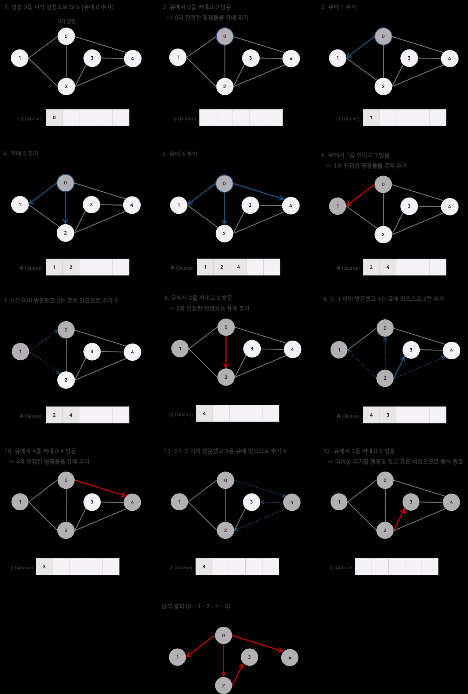

# 1일차
> 스터디 방향성과 각자의 기초테스트를 함
- 백준 예제를 준비했지만 당장 급한건 강사님의 과제물   
- 따라서 4명이 합심한 과제물을 강사님에게 제출하기로 결정
- 총 5가지 기능을 목표로 함
   1. 단면출력+흑백
   2. 양면출력+흑백
   3. 용지추가
   4. 현재용지 확인
   5. 팩스
- 같은 스승님에게 가르침을 받아서인지 기본 메소드는 비슷하지만 사용위치와 경험적 부분에서 차이가 있었음
## 1일차 작업물
```java
// 고용훈
package printer;

public class Printer {

    int numOfPaper;

    public Printer(int numOfPaper){
        this.numOfPaper = numOfPaper;

    }

    public void prtPaper(int amount) {
        if(numOfPaper==0){
            System.out.println("용지없음");
        }else if(numOfPaper<amount){
            System.out.println("용지가"+(amount-numOfPaper)+" 필요");
            numOfPaper -= amount;
            System.out.println(amount+"남음");
            System.out.println((-1)*numOfPaper+"장 출력");
        }
    }
}

ㅡㅡㅡㅡㅡㅡㅡㅡㅡㅡㅡㅡㅡㅡㅡㅡㅡㅡㅡㅡㅡㅡㅡㅡㅡㅡㅡㅡㅡㅡ

package printer;

public class PrinterMain {
    public static void main(String[] args) {
        Printer prt = new Printer(10);
        prt.prtPaper(20);

    }
}
// 자리비움 이슈
```
- 이렇게 구성했고 추가적으로 작업을 해야함
- 팩스 기능을 우선적으로 넣어야함
- 복습하는 스터디는 어떻게 할지 고민해야할듯
# 2일차
-일단 할 수 있는 것들을 다해봤다

```java
package printer;

import java.util.Scanner;

public class PrinterMain {//남은 것 1.컬러, 흑백 선택하기 2. 상속 받는걸로 개선
    public  static  Card[] cardArray = new Card[100];//100명의 팩스 주소를 담을 그릇
    //100명의 프린터카드 고객을 담을 그릇도 만들어줘야함 아니면 100명의 사람에게 전화번호, 이름, 잔액 으로 폰번호로 팩스도 보내고 프린터 결재도 하려함
    public   static Scanner scan = new Scanner(System.in);//팩스 입력시 개인정보도 들어가니 프라이빗


    public static void main(String[] args) {
        int selectNo;
        boolean run = true;

        while (run){//while+boolean으로 초기에 인쇄와 팩스 중 선택해서 나가기로
            System.out.println("===========================================");
            System.out.println("| 1. 인쇄 | 2. 팩스 | 3. 고객카드 생성 | 4. 종료|");
            System.out.println("===========================================");
            System.out.println("선택>> ");
            selectNo = scan.nextInt();
            System.out.println();

            switch (selectNo){
                case 1:
                    System.out.println("1. 인쇄");
                    Print();//인쇄에서 단면 양면을 셀렉하는 메소드로 이동
                    break;
                case 2:
                    System.out.println("2. 팩스");
                    fax();//팩스 메소드로 이동해서 등록된 프린터카드의 사람에게 팩스를 보냄
                    break;
                case 3:
                    System.out.println("3. 고객 카드 생성");
                    CreateCard();//에서 고객카드 생성
                    break;
                case 4:
                    System.out.println("4. 종료");
                    run = false;
                    break;
                default:
                    System.out.println("잘못된 번호");
                    break;
            }
            System.out.println();
        }
    }
    public static void Print(){
        boolean run = true;
        int selectNo;
        int selectNo2;
        int phoneNo;

        while (run){//인쇄 까지 왔다 이제 단면인쇄랑 양면인쇄 구현
            System.out.println("========================");
            System.out.println("| 1.단면인쇄 | 2. 양면인쇄|");
            System.out.println("========================");
            System.out.println("선택>>");
            selectNo = scan.nextInt();

            if (selectNo==1){ //이번엔 if문을 써보고 싶었음. 위처럼 while도 가능
                System.out.println("1. 단면인쇄");
                System.out.println();
                System.out.println("핸드폰 뒷자리 입력 : ");
                phoneNo = scan.nextInt();
                Card card = findCard(phoneNo);
                if(card==null){
                    System.out.println("미등록 고객");
                    System.out.println();
                    return;
                }
                System.out.println("출력 매수");
                SinglePrint singlePrt = new SinglePrint(100); //단면인쇄로
                selectNo2 = scan.nextInt();
                singlePrt.SinglePrt(selectNo2);
                card.setBalance(card.getBalance()-(selectNo2*50));//출력매수 만큼 감소
                System.out.println("남은 잔액 : "+card.getBalance());
                run=false;

            }else if(selectNo==2){
                System.out.println("2. 양면인쇄");
                System.out.println();
                System.out.println("핸드폰 뒷자리 입력 : ");
                phoneNo = scan.nextInt();
                Card card = findCard(phoneNo);
                if(card==null){
                    System.out.println("미등록 고객");
                    System.out.println();
                    return;
                }
                System.out.println("출력 매수");
                DoublePrint doublePrt = new DoublePrint(100);
                selectNo2 = scan.nextInt();
                doublePrt.DoublePrt(selectNo2);
                card.setBalance(card.getBalance()-(selectNo2*50));
                System.out.println("남은 잔액 : "+card.getBalance());
                run =false;

//                doublePrint();//양면인쇄로

            }else {
                System.out.println("잘못된 번호");
            }//인쇄도 여기서 다 구현해버리자 if안에서
        }
    }
    public static void fax(){//팩스는 팩스전송(고객확인 후 일치하면 성공하는작업, 미등록고객은 생성하라고)
        int phoneNo1;//내 번호
        int phoneNo2;//상대 번호
        int FaxNo; //팩스 보내는 매수

        System.out.println("*주의* 등록된 고객에게만 전송가능");
        System.out.println("보내시는분 번호 : ");
        phoneNo1 = scan.nextInt();
        Card card1 = findCard(phoneNo1);
        if(card1==null){//보내는 사람이 등록되어있는지
            System.out.println("미등록 고객");
            System.out.println();
            return;
        }
        System.out.println("받으시는분 번호 : ");
        phoneNo2 = scan.nextInt();
        Card card2 = findCard(phoneNo2);
        if(card2==null){//받는사람이 등록되어있는지
            System.out.println("미등록 고객");
            System.out.println();

        }else {
            System.out.println("팩스 보내시는 매수 : ");
            FaxNo = scan.nextInt();
            card1.setBalance(card1.getBalance()-(FaxNo*50));
            System.out.println("전송 성공");
            System.out.println("남은잔액 : "+card1.getBalance());
        }


    }

    public static void CreateCard(){
        int phoneNo;
        String owner;
        int balance;

        System.out.println("핸드폰 뒷자리 입력 : ");
        phoneNo = scan.nextInt();
        System.out.println("고객 성명 : ");
        owner = scan.next();
        System.out.println("초기 잔액 : ");
        balance = scan.nextInt();
        //이제 고객들을 배열로 저장해보자

        Card newCard = new Card(phoneNo,owner,balance);
        for(int i=0; i<cardArray.length; i++)
            if (cardArray[i]==null){
                cardArray[i]=newCard;
                System.out.println("카드 발급 완료");
                break;
            }//카드생성까지 완료
    }
    private static Card findCard(int phoneNo){
        Card card = null;
        for(int i=0; i<cardArray.length; i++){
            if(cardArray[i]!=null){
                int dbPhoneNo = cardArray[i].getPhoneNo();
                if(dbPhoneNo==phoneNo){
                    card = cardArray[i];
                    break;
                }
            }
        }
        return card;

    }
}
//1. 메인클래스

package printer;

public class SinglePrint {
    private int numOfPaper;

    public SinglePrint(int numOfPaper) {
        this.numOfPaper = numOfPaper;
    }
    public SinglePrint() {

    }

    public void SinglePrt(int amount){//amount는 내가 사용할 용지 매수
        //이제 고객 조회를 하고 있는지 확인하고 amount만큼 차감
        if(numOfPaper==0){
            System.out.println("인쇄용지 부족");
        }else if(numOfPaper<amount){//사용할 용지가 초기용지보다 큰경우 알아서 잘 복사하고 남은 용지 표시해야함
            System.out.println((amount-numOfPaper+"매 부족합니다"));
        }else {//남은 경우는 사용할 용지가 초기 용지보다 작은경우 그냥 올바르게 프린트된다
            numOfPaper -= amount;

            System.out.println(numOfPaper+"매 남았습니다");

        }
    }

}
//2. 그 안에 들어가는 단면복사클래스

package printer;

public class DoublePrint {
    private int numOfPaper;

    public DoublePrint(int numOfPaper) {
        this.numOfPaper = numOfPaper;
    }
    public DoublePrint() {

    }

    public void DoublePrt(int amount){//amount는 내가 사용할 용지 매수
        if(amount%2==1){
            amount = amount+1;//홀수일때 +1을 준다
        }

        if(numOfPaper==0){
            System.out.println("인쇄용지 부족");
        }else if(numOfPaper<Math.round(amount/2)){//사용할 용지가 초기용지보다 큰경우 알아서 잘 복사하고 남은 용지 표시해야함
            System.out.println((Math.round(amount/2)-numOfPaper+"매 부족합니다"));
        }else {//남은 경우는 사용할 용지가 초기 용지보다 작은경우 그냥 올바르게 프린트된다
            numOfPaper -= Math.round(amount/2);
            System.out.println(numOfPaper+"매 남았습니다");

        }
    }
}
//3. 양면복사 클래스

package printer;

public class Card {//계정을 만들고싶다
    private int phoneNo;
    private String owner;
    private int balance;

    public Card(int phoneNo, String owner, int balance) {
        this.phoneNo = phoneNo;
        this.owner = owner;
        this.balance = balance;
    }

    public int getPhoneNo() {
        return phoneNo;
    }

    public void setPhoneNo(int phoneNo) {
        this.phoneNo = phoneNo;
    }

    public String getOwner() {
        return owner;
    }

    public void setOwner(String owner) {
        this.owner = owner;
    }

    public int getBalance() {
        return balance;
    }

    public void setBalance(int balance) {
        this.balance = balance;
    }
}
//4. 프라이빗한 카드고객 클래스
```
- 마지막 조정으로 흑백 50원 컬러 100원과 상속관계를 나타낼 수 있는 것을 빼내는 것인데 아직 배움이 더 필요한거 같다
- Ctrl+Shift+F 꼭 해주자

```java
package printer;

import java.util.Scanner;

public class PrinterMain {// 남은 것 1. 상속 받는걸로 개선
	public static Card[] cardArray = new Card[100];// 100명의 카드생성 고객을 담을 곳, 카드에 전화번호와 프린트결재기능까지 있음
	public static Scanner scan = new Scanner(System.in);

	public static void main(String[] args) {
		int selectNo;
		boolean run = true;

		while (run) {// while+boolean으로 초기에 인쇄와 팩스 중 선택해서 나가기로
			System.out.println("===========================================");
			System.out.println("| 1. 인쇄 | 2. 팩스 | 3. 고객카드 생성 | 4. 종료|");
			System.out.println("===========================================");
			System.out.println("선택>> ");
			selectNo = scan.nextInt();
			System.out.println();

			switch (selectNo) {
			case 1:
				System.out.println("1. 인쇄");
				Print();// 인쇄에서 단면 양면을 셀렉하는 메소드로 이동
				break;
			case 2:
				System.out.println("2. 팩스");
				fax();// 팩스 메소드로 이동해서 등록된 프린터카드의 사람에게 팩스를 보냄
				break;
			case 3:
				System.out.println("3. 고객 카드 생성");
				CreateCard();// 에서 고객카드 생성
				break;
			case 4:
				System.out.println("4. 종료");
				run = false;
				break;
			default:
				System.out.println("잘못된 번호");
				break;
			}
			System.out.println();
		}
	}

	public static void Print() {
		boolean run = true;
		int selectNo;
		int selectNo2;
		int phoneNo;
		int color;
		String msg1 = "잔액이 부족합니다. 카운터에서 잔금을 결재해주세요.";

		while (run) {// 인쇄 까지 왔다 이제 단면인쇄랑 양면인쇄 구현
			System.out.println("========================");
			System.out.println("| 1.단면인쇄 | 2. 양면인쇄|");
			System.out.println("========================");
			System.out.println("선택>>");
			selectNo = scan.nextInt();

			if (selectNo == 1) { // 이번엔 if문을 써보고 싶었음. 위처럼 while도 가능
				System.out.println("1. 단면인쇄");
				System.out.println();
				System.out.println("핸드폰 뒷자리 입력 : ");
				phoneNo = scan.nextInt();
				Card card = findCard(phoneNo);
				if (card == null) {
					System.out.println("미등록 고객");
					System.out.println();
					return;
				}
				System.out.println("출력 매수");
				SinglePrint singlePrt = new SinglePrint(100); // 단면인쇄로
				selectNo2 = scan.nextInt();
				// 흑백 컬러를 여기서 구현. 흑백 50원 컬러 100원
				System.out.println("========================");
				System.out.println("| 1.흑백인쇄 | 2. 컬러인쇄|");
				System.out.println("========================");
				color = scan.nextInt();
				if (color == 1) {
					singlePrt.SinglePrt(selectNo2);
					card.setBalance(card.getBalance() - (selectNo2 * 50));// 출력매수 만큼 감소
					if (card.getBalance() < 0) {
						System.out.println(msg1);
						break;
					}
					System.out.println("남은 잔액 : " + card.getBalance());
					run = false;
				} else if (color == 2) {
					singlePrt.SinglePrt(selectNo2);
					card.setBalance(card.getBalance() - (selectNo2 * 100));
					if (card.getBalance() < 0) {
						System.out.println(msg1);
						break;
					}
					System.out.println("남은 잔액 : " + card.getBalance());
					run = false;
				} else {
					System.out.println("잘못된 번호");
					return;
				}

			} else if (selectNo == 2) {
				System.out.println("2. 양면인쇄");
				System.out.println();
				System.out.println("핸드폰 뒷자리 입력 : ");
				phoneNo = scan.nextInt();
				Card card = findCard(phoneNo);
				if (card == null) {
					System.out.println("미등록 고객");
					System.out.println();
					return;
				}
				System.out.println("출력 매수");
				DoublePrint doublePrt = new DoublePrint(100);
				selectNo2 = scan.nextInt();
				System.out.println("========================");
				System.out.println("| 1.흑백인쇄 | 2. 컬러인쇄|");
				System.out.println("========================");
				color = scan.nextInt();
				if (color == 1) {
					doublePrt.DoublePrt(selectNo2);
					card.setBalance(card.getBalance() - (selectNo2 * 50));
					if (card.getBalance() < 0) {
						System.out.println(msg1);
						break;
					}
					System.out.println("남은 잔액 : " + card.getBalance());
					run = false;
				} else if (color == 2) {
					doublePrt.DoublePrt(selectNo2);
					card.setBalance(card.getBalance() - (selectNo2 * 100));
					if (card.getBalance() < 0) {
						System.out.println(msg1);
						break;
					}
					System.out.println("남은 잔액 : " + card.getBalance());
					run = false;
				}
//                doublePrint();//양면인쇄로

			} else {
				System.out.println("잘못된 번호");
			} // 인쇄도 여기서 다 구현해버리자 if안에서
		}
	}

	public static void fax() {// 팩스는 팩스전송(고객확인 후 일치하면 성공하는작업, 미등록고객은 생성하라고)
		int phoneNo1;// 내 번호
		int phoneNo2;// 상대 번호
		int FaxNo; // 팩스 보내는 매수

		System.out.println("*주의* 등록된 고객에게만 전송가능");
		System.out.println("보내시는분 번호 : ");
		phoneNo1 = scan.nextInt();
		Card card1 = findCard(phoneNo1);
		if (card1 == null) {// 보내는 사람이 등록되어있는지
			System.out.println("미등록 고객");
			System.out.println();
			return;
		}
		System.out.println("받으시는분 번호 : ");
		phoneNo2 = scan.nextInt();
		Card card2 = findCard(phoneNo2);
		if (card2 == null) {// 받는사람이 등록되어있는지
			System.out.println("미등록 고객");
			System.out.println();

		} else {
			System.out.println("팩스 보내시는 매수 : ");
			FaxNo = scan.nextInt();
			card1.setBalance(card1.getBalance() - (FaxNo * 50));
			System.out.println("전송 성공");
			System.out.println("남은잔액 : " + card1.getBalance());
		}

	}

	public static void CreateCard() {
		int phoneNo;
		String owner;
		int balance;

		System.out.println("핸드폰 뒷자리 입력 : ");
		phoneNo = scan.nextInt();
		System.out.println("고객 성명 : ");
		owner = scan.next();
		System.out.println("초기 잔액 : ");
		balance = scan.nextInt();
		// 이제 고객들을 배열로 저장해보자

		Card newCard = new Card(phoneNo, owner, balance);
		for (int i = 0; i < cardArray.length; i++)
			if (cardArray[i] == null) {
				cardArray[i] = newCard;
				System.out.println("카드 발급 완료");
				break;
			} // 카드생성까지 완료
	}

	private static Card findCard(int phoneNo) {
		Card card = null;
		for (int i = 0; i < cardArray.length; i++) {
			if (cardArray[i] != null) {
				int dbPhoneNo = cardArray[i].getPhoneNo();
				if (dbPhoneNo == phoneNo) {
					card = cardArray[i];
					break;
				}
			}
		}
		return card;

	}

}

```
- 메인을 수정하고 흑백 기능을 넣었다.

```java
package printer;

public class SinglePrint {
	private int numOfPaper;

	public SinglePrint(int numOfPaper) {
		this.numOfPaper = numOfPaper;
	}

	public SinglePrint() {

	}

	public void SinglePrt(int amount) {// amount는 내가 사용할 용지 매수
		// 이제 고객 조회를 하고 있는지 확인하고 amount만큼 차감
		if (numOfPaper == 0) {
			System.out.println("인쇄용지 부족");
		} else if (numOfPaper < amount) {// 사용할 용지가 초기용지보다 큰경우 알아서 잘 복사하고 남은 용지 표시해야함
			System.out.println((amount - numOfPaper + "매 부족합니다"));
		} else {// 남은 경우는 사용할 용지가 초기 용지보다 작은경우 그냥 올바르게 프린트된다
			numOfPaper -= amount;

			System.out.println("프린터에 용지가 "+numOfPaper + "매 남았습니다");

		}
	}

}

package printer;

public class DoublePrint {
	private int numOfPaper;

	public DoublePrint(int numOfPaper) {
		this.numOfPaper = numOfPaper;
	}

	public DoublePrint() {

	}

	public void DoublePrt(int amount) {// amount 는 내가 사용할 용지 매수
		if (amount % 2 == 1) {
			amount = amount + 1;// 홀수일때 +1을 준다
		}

		if (numOfPaper == 0) {
			System.out.println("인쇄용지 부족");
		} else if (numOfPaper < Math.round(amount / 2)) {// 사용할 용지가 초기용지보다 큰경우 알아서 잘 복사하고 남은 용지 표시해야함
			System.out.println((Math.round(amount / 2) - numOfPaper + "매 부족합니다"));
		} else {// 남은 경우는 사용할 용지가 초기 용지보다 작은경우 그냥 올바르게 프린트된다
			numOfPaper -= Math.round(amount / 2);
			System.out.println("프린터에 용지가 "+numOfPaper + "매 남았습니다");

		}
	}

}

```
- 추가 핫픽스로 남은용지 표기에 "프린터에 용지가 "를 추가

```java
package printer;

import java.util.Scanner;

public class PrinterMain {
	// 추가해야하는 것 
	//1. 상속 받는걸로 개선 
	//2. 등록된 고객들 리스트 + 잔액
	public static Card[] cardArray = new Card[100];// 100명의 카드생성 고객을 담을 곳, 카드에 전화번호와 프린트결재기능까지 있음
	public static Scanner scan = new Scanner(System.in);

	public static void main(String[] args) {
		int selectNo;
		boolean run = true;

		while (run) {// while+boolean으로 초기에 인쇄와 팩스 중 선택해서 나가기로
			System.out.println("===========================================");
			System.out.println("| 1. 인쇄 | 2. 팩스 | 3. 고객카드 생성 | 4. 종료|");
			System.out.println("===========================================");
			System.out.println("선택>> ");
			selectNo = scan.nextInt();
			System.out.println();

			switch (selectNo) {
			case 1:
				System.out.println("1. 인쇄");
				Print();// 인쇄에서 단면 양면을 셀렉하는 메소드로 이동
				break;
			case 2:
				System.out.println("2. 팩스");
				fax();// 팩스 메소드로 이동해서 등록된 프린터카드의 사람에게 팩스를 보냄
				break;
			case 3:
				System.out.println("3. 고객 카드 생성");
				CreateCard();// 에서 고객카드 생성
				break;
			case 4:
				System.out.println("4. 종료");
				run = false;
				break;
			default:
				System.out.println("잘못된 번호");
				break;
			}
			System.out.println();
		}
	}

	public static void Print() {
		boolean run = true;
		int selectNo;
		int selectNo2;
		int phoneNo;
		int color;
		String msg1 = "잔액이 부족합니다. 카운터에서 잔금을 결재해주세요.";

		while (run) {// 인쇄 까지 왔다 이제 단면인쇄랑 양면인쇄 구현
			System.out.println("========================");
			System.out.println("| 1.단면인쇄 | 2. 양면인쇄|");
			System.out.println("========================");
			System.out.println("선택>>");
			selectNo = scan.nextInt();

			if (selectNo == 1) { // 이번엔 if문을 써보고 싶었음. 위처럼 while도 가능
				System.out.println("1. 단면인쇄");
				System.out.println();
				System.out.println("핸드폰 뒷자리 입력 : ");
				phoneNo = scan.nextInt();
				Card card = findCard(phoneNo);
				if (card == null) {
					System.out.println("미등록 고객");
					System.out.println();
					return;
				}
				System.out.println("출력 매수");
				SinglePrint singlePrt = new SinglePrint(100); // 단면인쇄로
				selectNo2 = scan.nextInt();
				// 흑백 컬러를 여기서 구현. 흑백 50원 컬러 100원
				System.out.println("========================");
				System.out.println("| 1.흑백인쇄 | 2. 컬러인쇄|");
				System.out.println("========================");
				color = scan.nextInt();
				if (color == 1) {
					singlePrt.SinglePrt(selectNo2);
					card.setBalance(card.getBalance() - (selectNo2 * 50));// 출력매수 만큼 감소
					if (card.getBalance() < 0) {
						System.out.println(msg1);
						break;
					}
					System.out.println("남은 잔액 : " + card.getBalance());
					run = false;
				} else if (color == 2) {
					singlePrt.SinglePrt(selectNo2);
					card.setBalance(card.getBalance() - (selectNo2 * 100));
					if (card.getBalance() < 0) {
						System.out.println(msg1);
						break;
					}
					System.out.println("남은 잔액 : " + card.getBalance());
					run = false;
				} else {
					System.out.println("잘못된 번호");
					return;
				}

			} else if (selectNo == 2) {
				System.out.println("2. 양면인쇄");
				System.out.println();
				System.out.println("핸드폰 뒷자리 입력 : ");
				phoneNo = scan.nextInt();
				Card card = findCard(phoneNo);
				if (card == null) {
					System.out.println("미등록 고객");
					System.out.println();
					return;
				}
				System.out.println("출력 매수");
				DoublePrint doublePrt = new DoublePrint(100);
				selectNo2 = scan.nextInt();
				System.out.println("========================");
				System.out.println("| 1.흑백인쇄 | 2. 컬러인쇄|");
				System.out.println("========================");
				color = scan.nextInt();
				if (color == 1) {
					doublePrt.DoublePrt(selectNo2);
					card.setBalance(card.getBalance() - (selectNo2 * 50));
					if (card.getBalance() < 0) {
						System.out.println(msg1);
						break;
					}
					System.out.println("남은 잔액 : " + card.getBalance());
					run = false;
				} else if (color == 2) {
					doublePrt.DoublePrt(selectNo2);
					card.setBalance(card.getBalance() - (selectNo2 * 100));
					if (card.getBalance() < 0) {
						System.out.println(msg1);
						break;
					}
					System.out.println("남은 잔액 : " + card.getBalance());
					run = false;
				}
//                doublePrint();//양면인쇄로

			} else {
				System.out.println("잘못된 번호");
			} // 인쇄도 여기서 다 구현해버리자 if안에서
		}
	}

	public static void fax() {// 팩스는 팩스전송(고객확인 후 일치하면 성공하는작업, 미등록고객은 생성하라고)
		int phoneNo1;// 내 번호
		int phoneNo2;// 상대 번호
		int FaxNo; // 팩스 보내는 매수

		System.out.println("*주의* 등록된 고객에게만 전송가능");
		System.out.println("보내시는분 번호 : ");
		phoneNo1 = scan.nextInt();
		Card card1 = findCard(phoneNo1);
		if (card1 == null) {// 보내는 사람이 등록되어있는지
			System.out.println("미등록 고객");
			System.out.println();
			return;
		}
		System.out.println("받으시는분 번호 : ");
		phoneNo2 = scan.nextInt();
		Card card2 = findCard(phoneNo2);
		if (card2 == null) {// 받는사람이 등록되어있는지
			System.out.println("미등록 고객");
			System.out.println();

		} else {
			System.out.println("팩스 보내시는 매수 : ");
			FaxNo = scan.nextInt();
			card1.setBalance(card1.getBalance() - (FaxNo * 50));
			System.out.println("전송 성공");
			System.out.println("남은잔액 : " + card1.getBalance());
		}

	}

	public static void CreateCard() {
		int phoneNo;
		String owner;
		int balance;

		System.out.println("핸드폰 뒷자리 입력 : ");
		phoneNo = scan.nextInt();
		System.out.println("고객 성명 : ");
		owner = scan.next();
		System.out.println("초기 잔액 : ");
		balance = scan.nextInt();
		// 이제 고객들을 배열로 저장해보자

		Card newCard = new Card(phoneNo, owner, balance);
		for (int i = 0; i < cardArray.length; i++)
			if (cardArray[i] == null) {
				cardArray[i] = newCard;
				System.out.println("카드 발급 완료");
				break;
			} // 카드생성까지 완료
	}

	private static Card findCard(int phoneNo) {
		Card card = null;
		for (int i = 0; i < cardArray.length; i++) {
			if (cardArray[i] != null) {
				int dbPhoneNo = cardArray[i].getPhoneNo();
				if (dbPhoneNo == phoneNo) {
					card = cardArray[i];
					break;
				}
			}
		}
		return card;

	}

}

```
- 핫픽스로 남아있는 것 '목록 + 잔액' 추가

# 3일차
```java
package Exam;

public class Board {//완성 예제7
	private String title;
	private String content;
	
	public Board(String title, String content) {
		this.title = title;
		this.content = content;
	}

	public String getTitle() {
		return title;
	}

	public String getContent() {
		return content;
	}
	
	
	
	

}

package Exam;

import java.util.ArrayList;
import java.util.List;

public class BoardDao {//완성 예제7
	public List<Board> getBoardList(){//getBoardList라는 메소드를 생성하는데 타입이 스트링 인트 이런게 아니라 List<Board>라는 타입 Board는 다른 클래스에서 생성자를 미리 만듬
		List<Board> list = new ArrayList<Board>();
		list.add(new Board("제목1", "내용1"));
		list.add(new Board("제목2", "내용2"));
        list.add(new Board("제목3", "내용3"));
		
		return list;//여기서 나온 값은 list이니 list를 getBoardList를 호출하면 나오도록 저장
		
	}
}

package Exam;

import java.util.ArrayList;
import java.util.List;

public class BoardDao {//완성 예제7
	public List<Board> getBoardList(){//getBoardList라는 메소드를 생성하는데 타입이 스트링 인트 이런게 아니라 List<Board>라는 타입 Board는 다른 클래스에서 생성자를 미리 만듬
		List<Board> list = new ArrayList<Board>();
		list.add(new Board("제목1", "내용1"));
		list.add(new Board("제목2", "내용2"));
        list.add(new Board("제목3", "내용3"));
		
		return list;//여기서 나온 값은 list이니 list를 getBoardList를 호출하면 나오도록 저장
		
	}
}

// 예제 7번

package Exam2;
import java.util.Objects;

public class Student {//완성 예제 8번
    public int studentNum;
    public String name;

    public Student(int studentNum, String name) {
        this.studentNum = studentNum;
        this.name = name;
    }
    @Override
    public int hashCode(){
       return Objects.hash(studentNum);
    }

    @Override
    public boolean equals(Object obj) {//단순히 여기서는 학번(sNum)만 비교해서 같으면 없애버렷으면 됬음
        if(obj instanceof Student){
            Student student = (Student) obj;
            return (this.studentNum==student.studentNum);
        }else {
            return false;
        }
    }
}

package Exam2;

import java.util.HashSet;
import java.util.Iterator;
import java.util.Set;

public class HashSetExample {//완성 예제 8번
    public static void main(String[] args) {
        Set<Student> set = new HashSet<Student>();

        set.add(new Student(1,"홍길동"));
        set.add(new Student(2,"신용권"));
        set.add(new Student(1,"조민우"));

        Iterator<Student> iterator = set.iterator();
        while (iterator.hasNext()){
            Student student = iterator.next();
            System.out.println(student.studentNum+":"+student.name);
        }
   }
}
// 예제 8번 다 풀었지만 수정해야할거 같은점 있음

public class student {
	int studentNum;
	String name;

	public Studint(int studentNum, String name){
		this.studentNum = studentNum;
		this.name = name;
	}
	@Override
	public int hashCode(){
		return studentNum;
	}
	@Override
	public boolean equals(Object obj){
		if(obj instanceof Student){
			Student student = (Student) obj;
			if(this.studentNum==student.studentNum){
				return true;
			} else{
				return false;
			}
		}else {
			return false;
		}
	}
}

//추후 맨정신일 때 내 student클래스랑 진득하게 비교해볼것

```
- 이해는 되는데 능숙하지 않는 상태
- hashSet hasMap Iterator 등등 써봐야 할 것 많음
- 다음 스터디에는 9번 10번과 백준예제 1문항 풀어오기
- 다음주 월요일 스터디에는 git, github에 대한 스피치 5분 준비

# 4일차
- 스터디github를 한번 날림
- 내 커밋 ㅜㅜㅜㅜㅜㅜ
- 다들 9, 10번 잘 풀어 왔다
- 진호님의 이터레이터 사용에 감탄
```java
package Exam;
import java.util.HashMap;
import java.util.Map;
import java.util.Set;

public class MapExample {// 해쉬맵+ 맵+ 셋+ 향상된 for문
    public static void main(String[] args) {
        Map<String, Integer> map = new HashMap<>();
        // 기본 전제조건, 맵이란 객체에 해쉬맵형식을 담을거고 그 타입형식은 <스트링, 인티저> --->맵사용의 기본구조
        // 여기서 String이 키타입 Integer는 값타입
        // 뒤에 제네릭이 빠진이유는 명시적 인수타입 이라서
        map.put("blue",96);
        map.put("hong",86);
        map.put("white",97);
        // 세가지 값 입력

        String name = null;
        int maxScore = 0;
        int totalScore = 0;
        // 여기까지가 기본입력
        Set<Map.Entry<String, Integer>> entrySet = map.entrySet();
        //엔트리셋은 임포트한 set의 내장된 명령어로 맵 내부의 저장된 데이터를 다 불러오는 명령어
        //따라서 엔트리셋으로 불러온 데이터를 엔트리셋 객체에 전부 담아줌
        //배열로 따지면 int[] mapArray = new map[] 이랑 비슷한 구조
        for(Map.Entry<String, Integer> entry : entrySet){
            if(entry.getValue() > maxScore){
                //엔트리에서 맵의 값 타입을 맥스 스코어와 비교를하고
                //맥스스코어보다 크면 엔트리의 키 타입을 name에, 값 타입을 맥스스코어에 담는다
                name = entry.getKey();
                maxScore = entry.getValue();
            }
            totalScore += entry.getValue();
            //if를 다 돌때까지 값 타입을 누적하며 더하면서 점수합계를 구한다
        }

        System.out.println("평균점수 : "+totalScore/map.size());
        //map의 갯수는 size를 이용한다
        System.out.println("최고점수 : "+maxScore);
        System.out.println("최고점수를 받은 사람 : "+name);
    }
}
```
- hashMap을 사용한 9번예제

```java
package Exam;

import java.util.TreeSet;

public class TreeSetExample {
    public static void main(String[] args) {
        TreeSet<Student> treeSet = new TreeSet<>();
        treeSet.add(new Student("blue",96));
        treeSet.add(new Student("hong",9));
        treeSet.add(new Student("white",92));

        Student student = treeSet.last();
        System.out.println("최고점수 : "+student.score);
        System.out.println("최고점수를 받은 아이디 : "+student.id);
    }
}
```
- 10번 메인클래스

```java
package Exam;

public class Student implements Comparable<Student>{
	//트리셋은 비교메소드가 무조건 필요함
	//따라서 비교관련 인터페이스인 Comparable을 구현하고
	//오버라이드로 Comparable의 내부 메소드compareTo를 재정의해서 값을 비교하게 해야함
    public String id;
    public int score;

    public Student(String id, int score) {
        this.id = id;
        this.score = score;
    }
    @Override
    public int compareTo(Student o){
//        if(score<o.score) return -1;
//        else if(score==o.score) return 0;
//        else return 1;
    	//방법1

        Integer.compare(score,o.score);
        return score-o.score;
        //방법2
    }
    // 여기서 왜 -1 0 1 값만 구하느냐
    // 트리셋은 자료를 입력순서와 관계없이 오름차순으로 정렬해주기 때문에
    // 크기가 -1인 자료값부터 정렬한다
    // 따라서 크기가 1인 값을 출력하면 제일 큰 점수가 나오고
    // 이거를 메인에서 last로 불러서 출력하면 된다

}
```
- 10번 예제의 핵심, comparable을 구현해서 사용
- 다음 스터디는 상속부분 예제 8문제 + 백준예제1
- 상속에 대해서 진득하게 공부해보자

# 5일차
- 여러 이슈로 진호님이랑 둘만 진행
- 또한 미뤄진 스터디로 인터페이스까지 예제품
```java
import java.io.BufferedReader;
import java.io.IOException;
import java.io.InputStreamReader;
import java.util.Scanner;
import java.util.StringTokenizer;

public class backjoon1008 {
    public static void main(String[] args) throws IOException {
        BufferedReader br = new BufferedReader(new InputStreamReader(System.in));

        String str = br.readLine();
        StringTokenizer st = new StringTokenizer(str," ");
        double a = Double.parseDouble(st.nextToken());
        double b = Double.parseDouble(st.nextToken());

        System.out.println(a/b);
    }
}
```
- 오늘 문제의 핵심
- bufferedReader
- 최대한 이걸 써보도록 노력할 예정
- 내일은 git,github+중복인터페이스+백준예제 준비해야함

# 6일차
```java
private static void bfs(int i, int j) {
        Queue<Integer> q = new LinkedList<Integer>();

        q.offer(i*100 + j);
        visited[i][j] = 1;

        int pos = 0;
        while (q.isEmpty() == false){
            pos = q.poll();
            j= pos;
            j= pos%100;

            if(i > 0 && arr[i-1][j]==1 && visited[i-1][j]==0){
                visited[i-1][j]=1;
                q.offer((i-1)*100+j);//상 , 위로
            }
            if(i < N-1 && arr[i+1][j]==1 && visited[i+1][j]==0){
                visited[i+1][j]=1;
                q.offer((i+1)*100+j);// 하,
            }
            if(j > 0 && arr[i][j-1]==1 && visited[i][j-1]==0){
                visited[i][j-1]=1;
                q.offer(i*100+(j-1));// 왼쪽
            }
            if(j < M-1 && arr[i][j+1]==1 && visited[i][j+1]==0){
                visited[i][j+1]=1;
                q.offer(i*100+(j+1));// 오른쪽
            }
        }


    }
```
- 오늘 문제의 핵심

- BFS와 소수 찾기
- 진호님의 소수찾기에서 j와k를 나누면서 소수를 찾는게 인상적이었음
- 내일은 쓰레드예제+백준+ERD등등

# 7일차
- 오늘 문제의 핵심

- DFS와 인수분해
- 다음 스터디에서는 제네릭,람다식예제와 컬렉션프레임워크 이해, 백준예제 3개, 프로그래머스 sql 10문제

# 8일차
- 오늘 문제의 핵심
- stack의 push pop
- 다음 스터디에서는 [백준예제]1개 [프로그래머스]lv.2

# 9일차
- 오늘 문제의 핵심
- 프로그래머스의 lv.2의 중성화문제
- 다음 스터디에서는 [백준예제]2개

# 10일차
- 오늘 문제의 핵심
- 1. 스택
- 2. 10으로 나눈 나머지와 몫의 조합을 이용한 수학문제
- 3. 달력 요일구하기문제
- 다음 스터디에서는 [프린터예제]를 이용한 html,css,js

# 11일차
- 오늘 문제의 핵심
- 1. 나의 프린터 예제 및 보완사항
- 다음 스터디에서는 [프린터예제]보완 + 백준예제2개

# 12~13일차
- 오늘 문제의 핵심
- 1. 진호님의 프린터 예제 확인 및 보완사항
- 2. 다혜님의 백준예제 두 주사위 눈을 비교하여 눈 수가 작은 주사위 눈 만큼 점수에서 차감
- 3. 단비님, 승리님 영입
- 다음 스터디에서는 [프린터예제]보완 or 백준예제 3개, 다른분들의 실력을 보고싶음

# 프린터예제를 이용한 html,css,js
## controller
### AController
```java
import java.util.Random;

import org.json.simple.JSONArray;
import org.json.simple.JSONObject;
import org.springframework.web.bind.annotation.RequestMapping;
import org.springframework.web.bind.annotation.RestController;

@RestController
public class AController {	
	@RequestMapping("/checkid")
	public Object checkid(String cid) {
		String result = "";
		if(cid.equals("aaaa") || cid.equals("bbbb") || cid.equals("cccc")) {
			result = "f";
		}else {
			result = "t";
		}
		return result;
	}
	
	@RequestMapping("/daily")
	public Object daily() {
		//System.out.println("daily");//일매출을 누르면 발동되는거 확인됨
		Random r = new Random();
		JSONArray ja_data = new JSONArray();
		for(var i=1; i<=10; i++) {
			ja_data.add(r.nextInt(30000)+1);
		}
		JSONArray ja_cate = new JSONArray();
		ja_cate.add("한국");
		ja_cate.add("일본");
		ja_cate.add("중국");
		ja_cate.add("미국");
		ja_cate.add("싱가폴");
		ja_cate.add("미얀마");
		ja_cate.add("베트남");
		ja_cate.add("호주");
		ja_cate.add("태국");
		ja_cate.add("캄보디아");
		
		JSONObject jo = new JSONObject();
		jo.put("cate", ja_cate);
		jo.put("data", ja_data);
		//System.out.println(jo);//cate배열과, data배열이 sout되는걸 확인함
		return jo;
	}
	
	@RequestMapping("/monthly")
	public Object monthly() {
		//System.out.println("daily");//일매출을 누르면 발동되는거 확인됨
		Random r = new Random();
		JSONArray ja_data = new JSONArray();
		for(var i=1; i<=10; i++) {
			ja_data.add(r.nextInt(30000)+1);
		}
		JSONArray ja_cate = new JSONArray();
		ja_cate.add("대한민국");
		ja_cate.add("일본");
		ja_cate.add("중국");
		ja_cate.add("미국");
		ja_cate.add("싱가폴");
		ja_cate.add("미얀마");
		ja_cate.add("베트남");
		ja_cate.add("호주");
		ja_cate.add("태국");
		ja_cate.add("캄보디아");
		
		JSONObject jo = new JSONObject();
		jo.put("cate", ja_cate);
		jo.put("data", ja_data);
		//System.out.println(jo);//cate배열과, data배열이 sout되는걸 확인함
		return jo;
	}

}
```
### FaxController
```java
import org.springframework.stereotype.Controller;
import org.springframework.ui.Model;
import org.springframework.web.bind.annotation.RequestMapping;

@Controller
@RequestMapping("/fax")
public class FaxController {
	
	@RequestMapping("")
	public String fax(Model model) {
		model.addAttribute("center","fax/fax_center");
		return "main";
	}
}
```
### MainController
```java
import javax.servlet.http.HttpSession;

import org.springframework.stereotype.Controller;
import org.springframework.ui.Model;
import org.springframework.web.bind.annotation.RequestMapping;

import com.multi.vo.CustVO;
import com.multi.vo.FaxVO;
import com.multi.vo.PrintVO;

@Controller
public class MainController {
	@RequestMapping("/")
	public String main() {
		return "main";
	}
	
	@RequestMapping("/login")
	public String login(Model model) {
		model.addAttribute("center","login");
		return "main";
	}
	
	@RequestMapping("/mypage")
	public String mypage(Model model) {
		model.addAttribute("center","mypage");
		return "main";
	}
	
	@RequestMapping("/register")
	public String register(Model model) {
		model.addAttribute("center","register");
		return "main";
	}
	
	@RequestMapping("/logout")
	public String logout(HttpSession session) {
		if(session !=null) {
			session.invalidate();
		}
		return "main";
	}
	
	@RequestMapping("/loginimpl")
	public String loginimpl(String id, String pwd, Model model,
			HttpSession session) {
		  if(id.equals("qqqq")&&pwd.equals("1111")) {
			  session.setAttribute("loginid", id);
			  model.addAttribute("center","loginok"); 
		  }else { 
			  model.addAttribute("center","loginfail");
		  }	 
		return "main";
	}
	@RequestMapping("/registerimpl")
	public String registerimpl(Model model, CustVO cust) {
		System.out.println(cust);
		model.addAttribute("center","registerok");
		model.addAttribute("rid",cust.getId());
		return "main";
	}
	
	@RequestMapping("/pay_money")
	public String pay_money(PrintVO pvo, Model model, HttpSession session) {
		int paper1 = 50;
		int paper2 = 100;
		int result;
		
		if(pvo.getPrint_col().equals("blc")) {
			if(pvo.getPrint_side().equals("print_oneside")) {
				result = paper1*1*pvo.getPage();
			}else {
				result = paper1*2*pvo.getPage();
			}
		}else {
			if(pvo.getPrint_side().equals("print_oneside")) {
				result = paper2*1*pvo.getPage();
			}else {
				result = paper2*2*pvo.getPage();			
			}	
		}
		session.setAttribute("printpay", result);
		model.addAttribute("center","print_total"); 
		return "main";
		
	}
	
	@RequestMapping("/gotopay")
	public String gotopay(Model model) {
		//만약 로그인이 되어있다면
		//if() {
			model.addAttribute("center","main_center");			
		//}else {
		//	model.addAttribute("center","login");
		//}
		//아닌 경우는 로그인창으로 보내버린다
		return "main";
	}
	
	@RequestMapping("/fax_ok")
	public Object fax_ok(FaxVO fvo,  Model model) {
		model.addAttribute("center","fax_ok");
		return "main";
	}

}
```
### PrintController
```java
import org.springframework.stereotype.Controller;
import org.springframework.ui.Model;
import org.springframework.web.bind.annotation.RequestMapping;
@Controller
@RequestMapping("/print")
public class PrintController {
	
	@RequestMapping("")
	public String print(Model model) {
		model.addAttribute("center","print/print_center");
		return "main";

	}
}
```
### ServiceController
```java
import org.springframework.stereotype.Controller;
import org.springframework.ui.Model;
import org.springframework.web.bind.annotation.RequestMapping;

@Controller
@RequestMapping("/service")
public class ServieController {
	
	@RequestMapping("")
	public String service(Model model) {
		model.addAttribute("center","service/service_center");
		return "main";
	}
}
```
## VO
### CustVO
```java
public class CustVO {
	private String id;
	private String pwd;
	private String pwd2;
	public CustVO() {
	}
	public CustVO(String id, String pwd, String pwd2) {
		this.id = id;
		this.pwd = pwd;
		this.pwd2 = pwd2;
	}
	public String getId() {
		return id;
	}
	public void setId(String id) {
		this.id = id;
	}
	public String getPwd() {
		return pwd;
	}
	public void setPwd(String pwd) {
		this.pwd = pwd;
	}
	public String getPwd2() {
		return pwd2;
	}
	public void setPwd2(String pwd2) {
		this.pwd2 = pwd2;
	}	
}
```
### FaxVO
```java
public class FaxVO {
	private int reciver;
	private String fax_col;
	private String fax_side;
	public FaxVO() {
	}
	public FaxVO(int reciver, String fax_col, String fax_side) {
		this.reciver = reciver;
		this.fax_col = fax_col;
		this.fax_side = fax_side;
	}
	public int getReciver() {
		return reciver;
	}
	public void setReciver(int reciver) {
		this.reciver = reciver;
	}
	public String getFax_col() {
		return fax_col;
	}
	public void setFax_col(String fax_col) {
		this.fax_col = fax_col;
	}
	public String getFax_side() {
		return fax_side;
	}
	public void setFax_side(String fax_side) {
		this.fax_side = fax_side;
	}
	@Override
	public String toString() {
		return "FaxVO [reciver=" + reciver + ", fax_col=" + fax_col + ", fax_side=" + fax_side + "]";
	}
}
```
### PrintVO
```java
public class PrintVO {
	private String printno;
	private String layout;
	private String print_col;
	private String print_side = "" ;
	private int page ;
	
	public PrintVO() {
	}

	public PrintVO(String printno, String layout, String print_col, String print_side, int page) {
		this.printno = printno;
		this.layout = layout;
		this.print_col = print_col;
		this.print_side = print_side;
		this.page = page;
	}

	public String getPrintno() {
		return printno;
	}

	public void setPrintno(String printno) {
		this.printno = printno;
	}

	public String getLayout() {
		return layout;
	}

	public void setLayout(String layout) {
		this.layout = layout;
	}

	public String getPrint_col() {
		return print_col;
	}

	public void setPrint_col(String print_col) {
		this.print_col = print_col;
	}

	public String getPrint_side() {
		return print_side;
	}

	public void setPrint_side(String print_side) {
		this.print_side = print_side;
	}

	public int getPage() {
		return page;
	}

	public void setPage(int page) {
		this.page = page;
	}

	@Override
	public String toString() {
		return "PrintVO [printno=" + printno + ", layout=" + layout + ", print_col=" + print_col + ", print_side="
				+ print_side + ", page=" + page + "]";
	}

	
}
```
## 템플릿 - 메인
### fax_ok
```html
<style>
.sending{
	width:500px;
}
	.progress {
  position: absolute;
  bottom: 0;
  left: 0;
  z-index: 1;
  width: 100%;
  height: 30px;
  background-color: #000;
}

.progress .bar {
  position: absolute;
  top: 2px;
  left: 2px;
  width: calc(100% - 4px);
  height: calc(100% - 4px);
  background-color: #ff0b7b;
  transform-origin: right;
  animation: scaleX 10s 0s  forwards linear;
}

@keyframes scaleX {
  0% {
    transform: scaleX(1);
  }

  100% {
    transform: scaleX(0);
  }
}
</style>
<script>

$(document).ready(function(){
	$('#sending_bt').attr("disabled",true);
	setTimeout(() => {
		alert("전송 완료");
	}, 10000);
});
</script>
<div id="sending">
<h1>팩스 전송중</h1>
</div>
    	<!-- 팩스진행도 start -->
		<br><br><br>
		<div class="progress">
			<div class="bar"></div>
		</div>
		<div>
			<button id="sending_bt"><a href="/">전송완료</a></button>
		</div>

    	<!-- 팩스진행도 end -->
```
### login
```html
<script >
$(document).ready(function(){
	$('#login_form > button').click(function(){
		$('#login_form').attr(
				{
					'action':'/loginimpl',
					'method':'post'
				}
		);
		$('#login_form').submit();
	})
});
</script>


<div class="container">
	<div class="col-sm-5">
	  <h2>Login</h2>
	  <form id="login_form">
	    <div class="form-group">
	      <label for="id">ID:</label>
	      <input type="text" class="form-control" id="id" placeholder="Enter ID" name="id">
	    </div>
	    <div class="form-group">
	      <label for="pwd">Password:</label>
	      <input type="password" class="form-control" id="pwd" placeholder="Enter password" name="pwd">
	    </div>
	    <button class="btn btn-default">LOGIN</button>
	  </form>
	</div>
</div>
```
### loginfail
```html
<h1>LOGIN FAIL</h1>
<h4><a href="#">아이디/비밀번호 찾기</a></h4>
```
### loginok
```html
<h1>LOGIN OK</h1>
<h2 th:text="${session.loginid}+ ' 님 환영합니다.'"></h2>
```
### main_center
```html
<style>
	
</style>
<script>

</script>
<h1>사용할 서비스</h1>
<button id="print_bt"><a href="/print">인쇄</a></button>
<button id="fax_bt"><a href="/fax">팩스</a></button>
```
### main
```html
<!DOCTYPE html>
<html lang="ko" xmlns:th="http://www.thymeleaf.org">
<!-- 타임리프 선언명령어 -->
<head>
  <title>Bootstrap Example</title>
  <meta charset="utf-8">
  <meta name="viewport" content="width=device-width, initial-scale=1">
  <!-- 반응형 웹 -->
  <link rel="stylesheet" href="https://maxcdn.bootstrapcdn.com/bootstrap/3.4.1/css/bootstrap.min.css">
  <script src="https://ajax.googleapis.com/ajax/libs/jquery/3.6.0/jquery.min.js"></script>
  <script src="https://maxcdn.bootstrapcdn.com/bootstrap/3.4.1/js/bootstrap.min.js"></script>
  <!-- 차트 라이브러리 -->
  <script src="https://code.highcharts.com/highcharts.js"></script>
  <script src="https://code.highcharts.com/highcharts-3d.js"></script>
  <script src="https://code.highcharts.com/modules/exporting.js"></script>
  <script src="https://code.highcharts.com/modules/export-data.js"></script>
  <script src="https://code.highcharts.com/modules/accessibility.js"></script>
  
  <style>
    /* Remove the navbar's default margin-bottom and rounded borders */ 
    .navbar {
      margin-bottom: 0;
      border-radius: 0;
    }
    
    /* Set height of the grid so .sidenav can be 100% (adjust as needed) */
    .row.content {height: 450px}
    
    /* Set gray background color and 100% height */
    .sidenav {
      padding-top: 20px;
      background-color: #f1f1f1;
      height: 100%;
    }

    
    /* On small screens, set height to 'auto' for sidenav and grid */
    @media screen and (max-width: 767px) {
      .sidenav {
        height: auto;
        padding: 15px;
      }
      .row.content {height:auto;} 
    }
    
  </style>
</head>
<body>

<nav class="navbar navbar-inverse">
  <div class="container-fluid">
    <div class="navbar-header">
      <button type="button" class="navbar-toggle" data-toggle="collapse" data-target="#myNavbar">
        <span class="icon-bar"></span>
        <span class="icon-bar"></span>
        <span class="icon-bar"></span>                        
      </button>
      <a class="navbar-brand" href="/">LOGO</a>
    </div>
    <div class="collapse navbar-collapse" id="myNavbar">
      <ul class="nav navbar-nav">
        <li><a href="/print">인쇄</a></li>
        <li><a href="/fax">팩스</a></li>
        <li><a href="/service">고객서비스</a></li>

      </ul>
      <ul th:if="${session.loginid == null}" class="nav navbar-nav navbar-right">
        <li><a href="/login"><span class="glyphicon glyphicon-log-in"></span> Login</a></li>
        <li><a href="/register"><span class="glyphicon glyphicon-new-window"></span> Register</a></li>
      </ul>
      <ul th:unless="${session.loginid == null}" class="nav navbar-nav navbar-right">
      	<li><a href="/admin">관리자서비스</a></li>
      	<li><a href="/mypage" th:text="${session.loginid}"></a></li>
        <li><a href="/logout"><span class="glyphicon glyphicon-log-out"></span> Logout</a></li>
      </ul>
    </div>
  </div>
</nav>
  
<div class="container-fluid text-center">    
  <div class="row content">
			<!-- Main Center Start -->
			<div class="col-sm-8 text-left"	th:insert="${center} ? ${center} : main_center">
			</div>
			<!-- Main Center End -->
  </div>
</div>


</body>
</html>
```
### mypage
```html
<h1>내 정보</h1>
```
### print_total
```html
<script>
$(document).ready(function(){
	$('#gotopay').click(function(){
		//alert("만약 로그인이 안됐다면 로그인을 하라고 얼럿을 띄움")
		$('#gotopay_form').attr({
			'action':'/gotopay'
		});
		var printpay = result;
		alert(10000-printpay+"원");
	});
});
</script>

<h1>총 금액</h1>
<h2 id = payment th:text="'결제금액은 '+${session.printpay}+ ' 원 입니다.'"></h2>

<form id = "gotopay_form">
<button id="gotopay">결제하기</button>
</form> 
```
### register
```html
<script>
$(document).ready(function(){
	$('#register_form > button').click(function(){
		$('#register_form').attr({
			'action':'/registerimpl',
			'method':'get'
			// get<->post
		});
		$('#register_form').submit();
		//3. 레지스터 버튼을 누르면 함수발동
	});
	
	$('#pwd2').keyup(function(){
		var pwd = $('#pwd').val();
		var pwd2 = $('#pwd2').val();
		if(pwd == pwd2){
			$('#pspan').text('Correct');
		}else{
			$('#pspan').text('Incorrect');
			
		}
		
	});
	//4. 비번일치 이벤트 만들기
	
	$('#id').keyup(function(){
		//ajax5. 키업을 할때마다 ajax로 서버에 가서 데이터를 비교 하려는게 목표= 중복확인
		var id = $(this).val();
		//변수를 설정하고
		$.ajax({
			url:'/checkid',
			data:{'cid':id},
			success:function(result){
				if(result == 't'){
					$('#ispan').text('Available');
				}else{
					$('#ispan').text('Not Available');
					
				}
					
			}
				
		});
		//ajax를 불러오고 id값을 서버로 보냄
	});
});
</script>

<div class="container">
	<div class="col-sm-5">
	  <h2>Register</h2>
	  <form id="register_form">
	    <div class="form-group">
	      <label for="id">ID:</label>
	      <input type="text" class="form-control" id="id" placeholder="Enter ID" name="id">
	      <span id="ispan"></span>
	    </div>
	    <div class="form-group">
	      <label for="pwd">Password:</label>
	      <input type="password" class="form-control" id="pwd" placeholder="Enter password" name="pwd">
	    </div>
	    <div class="form-group">
	      <label for="pwd2">Password2:</label>
	      <input type="password" class="form-control" id="pwd2" placeholder="Enter password">
	      <span id="pspan"></span>
	    </div>
	    <!-- 1. 서버로 날아가는 비번은 1개면됨 2번의 name을 지워버림 -->
	    
	    <button class="btn btn-default">REGISTER</button>
	  </form>
	</div>
</div>
```
### registerok
```html
<h1>REGISTER OK</h1>
<h2 th:text="${rid}+' 님 환영합니다.'"></h2>
```
## 템플릿 - 기능
### fax_center
```html
<style>
	.fax_image{
		width: 500px;
		height: 500px;
		border: 2px solid blue;
	}
	.fax_bt{
		width: 50px;
		height: 30px;
	}

</style>
<script>
$(document).ready(function(){
	$('#fax_bt').click(function(){
		//alert("clear"); 데이터받은거 확인함
		$('#fax_form').attr({
			'action':'/fax_ok',
			'method':'get'
		});
		$('#fax_form').submit();
	});
});
</script>
<h1>팩스기능</h1>
<!-- 팩스기능을 선택하면 팩스로 보낼 애들에 대한 설정을 해줄 예정 -->
<!-- 보내려는 상대(전화번호로 보낸다), 양면팩스인지, 팩스 진행상황,  -->
<!-- 동작순서 -->
<!-- 1. 팩스 세팅을 한다 -->
<!-- 2. 팩스 버튼을 누른다 -->
<!-- 3. 회원 결제를 한다 -->
<!-- 4. 초당 10퍼씩 증가하는 프로그레스를 띄워주고 100퍼로 차면 fax_ok로 넘어간다 -->

<div class="container-fluid">
  <div class="row content">
    <div class="col-sm-8">
      <div class="fax_image">
      </div>
    </div>
    	<div class="col-sm-4 sidenav">
    		<form id="fax_form">
    	
    	<!-- 받는사람 start -->
    			<div class="reciver">
    				<label for="reciver">받는사람 :</label>
    				<input type="number" name="reciver">
    			</div>
    	<!-- 받는사람 end -->
    	
    	<!-- 컬러 start -->
	    <div class="form-group">
	      <label for="fax_col">컬러 :</label>
			<div class="fax_col">
				  <label><input type="radio" name="fax_col" value="col">컬러</label>
				</div>
				<div class="print_blc">
				  <label><input type="radio" name="fax_col" checked value="blc">흑백</label>
				</div>
	    </div>
    	<!-- 컬러 end -->
    	
    	<!-- 양면팩스 start -->
		<div class="fax_oneside">
		  <label><input type="radio" name="fax_side" checked value="fax_oneside">단면</label>
		</div>
		<div class="fax_bothside">
		  <label><input type="radio" name="fax_side" value="fax_bothside">양면</label>
		</div>
    	<!-- 양면인쇄 end -->
    	
	    <button id="fax_bt">팩스</button>
	  </form>
     </div>
  </div>
</div>
```
### print_center
```html
<style>
	.print_image{
		width: 500px;
		height: 500px;
		border: 2px solid red;
	}
	.print_bt{
		width: 50px;
		height: 30px;
	}

</style>
<script>
function display(result){
	//alert(result+"원 입니다.") 이거도 얼럿으로 나오는거 확인됨
};

$(document).ready(function(){
	$('#print_bt').click(function(){
		//alert('print_ok'); //프린트ok로 오는거 확인함 
		$('#print_form').attr({
			'action':'/pay_money',
			'method':'get',
			'success': function(result){
				display(result);
			}
		});
		$('#print_form').submit();
		
	});

});
</script>

<h1>인쇄기능</h1>
<!-- 좌 우로 나눠서 왼쪽은 프린트할 이미지 오른쪽은 인쇄 설정을 보여주려함 -->
<!-- 왼쪽은 임의의 사진으로 대체 -->
<!-- 오른쪽은  스크롤 다운 옵션버튼으로-->
<!-- 사용할 프린터, 매수, 레이아웃 방향, 컬러 -->
<!-- 동작순서 -->
<!-- 1. 프린트 세팅을 한다 -->
<!-- 2. 프린트 버튼을 누른다 -->
<!-- 3. 결제화면으로 간다. 로그인을 안했으면 로그인으로 -->
<!-- 4. 결제가 됬으면 충전금액이 차감되고 print_ok로 넘어간다 -->
<div class="container-fluid">
  <div class="row content">
    <div class="col-sm-8">
      <div class="print_image">
      </div>
    </div>
    <div class="col-sm-4 sidenav">
    	<form id="print_form">
    	
    	<!-- 프린터no start -->
			    <!-- <div class="form-group">
			      <label for="printno">사용하려는 프린터 :</label>
					<select id="printno">
						<option value="print1">프린터1</option>
						<option value="print2">프린터2</option>
						<option value="print3">프린터3</option>
					</select>
			    </div> 이게 데이터를 널로 받아버림-->
			      <label for="printno">사용하려는 프린터 :</label>
					   <div class = "printno">
						<div class="print_1">
						  <label><input type="radio" name="printno" value="print_1">프린터1</label>
						</div>
						<div class="print_2">
						  <label><input type="radio" name="printno" value="print_2">프린터2</label>
						</div>
						<div class="print_3">
						  <label><input type="radio" name="printno" value="print_3">프린터3</label>
						</div>
					   </div><br>
    	<!-- 프린터no end -->
    	
    	<!-- 레이아웃 start -->
			    <!-- <div class="form-group">
			      <label for="layout">레이아웃 :</label>
					<select id="layout">
						<option value="ver">세로</option>
						<option value="hor">가로</option>
					</select>
			    </div> -->
			      <label for="layout">레이아웃 :</label>
					   <div class = "layout">
					    <div class="ver">
						  <label><input type="radio" name="layout" value="ver">세로</label>
						</div>
						<div class="hor">
						  <label><input type="radio" name="layout" value="hor">가로</label>
						</div>
					   </div><br>
    	<!-- 레이아웃 end -->
    	
    	<!-- 컬러 start -->
			    <!-- <div class="form-group">
			      <label for="print_col">컬러 :</label>
					<select id="print_col">
						<option value="col">컬러</option>
						<option value="blk">흑백</option>
					</select>
			    </div> -->
			      <label for="print_col">컬러 :</label>
					   <div class = "col">
					    <div class="print_col">
						  <label><input type="radio" name="print_col" value="col">컬러</label>
						</div>
						<div class="print_blc">
						  <label><input type="radio" name="print_col" value="blc">흑백</label>
						</div>
					   </div><br>
    	<!-- 컬러 end -->
    	
    	<!-- 양면인쇄 start -->
		    	<label for="printside">단면/양면 :</label>
					   <div class = "printside">
						<div class="print_oneside">
						  <label><input type="radio" name="print_side" value="print_oneside">단면</label>
						</div>
						<div class="print_bothside">
						  <label><input type="radio" name="print_side" value="print_bothside">양면</label>
						</div>
					   </div><br>
    	<!-- 양면인쇄 end -->
    	
    	<!-- 개수 start -->
			    <div class="page">
			      <label for="page">매수 :</label>
			      <input type="number" class="form-control" id="page" name="page" min="0" max="100">
			    </div>
			    <button id="print_bt">인쇄</button>
	  		</form>
          </div>
  </div>
</div>
```
### service_center
```html
<h1>관리자 서비스- 다른계정 충전하기</h1>
<!-- 금액 충전하는게 목표 -->
<!-- 1. 임의값인 내정보를 불러온다 -->
<!-- 2. 금액을 입력하고, 버튼을 누르면 충전하여 데이터를 갱신한다 -->
```
### admin_center
```html
<style>
#container{
	width:500px;
	height:400px;
	border:2px solid white;
}
</style>
<script>
function display(data){// 여기서 안됨
	//alert(data);//여기서 안됨, 이유 찾음 = 차트라이브러리 안불러옴
	//일단 각 버튼을 누르면 일매출 월매출 나오도록 만듬 근데 지금은 랜덤함수임
	//항복부터 1~31일 과 1~12월 로 바꾸고 매출은 랜덤이 아니라 일단은 임의값으로 줄예정
	 Highcharts.chart('container', {
	    chart: {
	        type: 'column',
	        options3d: {
	            enabled: true,
	            alpha: 10,
	            beta: 25,
	            depth: 70
	        }
	    },
	    title: {
	        text: 'MyChart'
	    },
	    subtitle: {
	        text: 'Source: ' +
	            '<a href="https://www.ssb.no/en/statbank/table/08804/"' +
	            'target="_blank">Multi</a>'
	    },
	    plotOptions: {
	        column: {
	            depth: 25
	        }
	    },
	    xAxis: {
	        categories: data['cate'],//15. data라는 제이슨오브젝트에서 'cate'를 끄집어냄
	        labels: {
	            skew3d: true,
	            style: {
	                fontSize: '16px'
	            }
	        }
	    },
	    yAxis: {
	        title: {
	            text: 'NOK (million)',
	            margin: 20
	        }
	    },
	    tooltip: {
	        valueSuffix: ' MNOK'
	    },
	    series: [{
	        name: 'Total imports',
	        data : data['data']
	    }]
	}); 
};

function getdata(){
	$.ajax({
		url:'/daily',
		success:function(data){
			//alert(data); //여기까지 데이터 오는거 확인됨
			display(data);
		}
	}) 
};

function getdata2(){
	$.ajax({
		url:'/monthly',
		success:function(data){
			display(data);
		}
	})
};

$(document).ready(function(){
	$('#daily').click(function(){
		getdata();
	});
	$('#monthly').click(function(){
		getdata2();
	});
});
</script>
<h1>관리자 서비스</h1>
<button id = "daily">일 매출 현황</button>
<button id = "monthly">월 매출 현황</button>
<div id = "container"></div>
<!-- 월 매출 같은 경우는 차트를 이용해서 한달간의 차트를 보여주고 -->
<!-- 전년 매출과 비교하는 막대그래프도 넣고싶음 -->
<!-- count같은 걸로 하루 프린트 이용량 -->
<!-- 컬러프린트매출, 흑백프린트매출 이런것도 보면 좋을듯? -->
```
### 앞으로 해야할 것
- 각 작업을 하고 난 후 금액 차감하는 기능
- 관리자에서 금액을 추가하는 기능
- 관리자에서 매출 매입 이런거 관리
- 